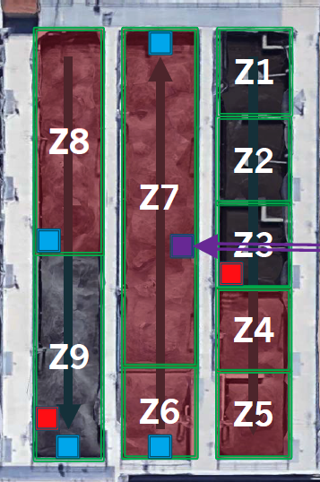

```{r setup, include=FALSE}
knitr::opts_chunk$set(
  comment = "#", fig.height = 4, 
  cache = FALSE,  collapse = TRUE,
  error = TRUE
)
```


\begin{center} 
CSI 2300: Introduction to Data Science

Exam 03
\end{center} 

**Exam Guidelines:**

* Show your code for every question.
* Submit your solutions as a .pdf knitted from a Markdown document.
* You may use your notes and any online resources.
* You may not confer with other students or people.
* If you have a question, Dr. Wilkerson will be on hand to answer them.  Email directly to rachel_wilkerson@baylor.edu (not through Canvas).


The data that you will use for this exam come from the Boulder Water Resource and Recovery Facility, and they were also used for the Lecture 6 in-class exercises.  Here is a short review of the data.

First is a picture of the facility where the data are collected.  It shows three aeration basins together, and the next plot shows a diagram of the flow of water through one aeration basin.  The red highlighted basins are ``aerated," meaning that oxygen is being pumped by blowers into the sludge, and the other basins are not aerated.  Two goals in this exam are to (1)  predict ammonia in Zone 7 and (2) classify observations as occurring on weekends versus weekdays using the measured numeric variables. 


{width=50%}
{width=25%}
{width=30%}


Run this code first.  It  loads the data, adds two columns that are a function of the hour of the day, and removes one redundant column. If you do not have the `mowater` library, then load the `boulder_ammonia.rda` dataset, and run the lines after the comment `Data Wrangling`.
```{r  include=TRUE}
#suppressMessages(library(mowateR))
#data(boulder_ammonia)
suppressMessages(library(lubridate))
load("boulder_ammonia.rda")

# Data Wrangling
obs_hour <- hour(boulder_ammonia$Date.Time)
obs_minute <- minute(boulder_ammonia$Date.Time)
boulder_ammonia$cosine_hour <- cos((obs_hour + obs_minute/60)*(360/24)*pi/180)
boulder_ammonia$sine_hour <- sin((obs_hour + obs_minute/60)*(360/24)*pi/180)

boulder_ammonia <- boulder_ammonia[ , -15]
```

1.  Split the data such that  observations 5,000 to 9,999 are in a dataframe representing the training set, and  observations 15,000 to 19,999 are in a dataframe representing the testing set.  Call these `train` and `test`, respectively. (4 points)

```{r}
train <- boulder_ammonia[5000:9999, ]
test <- boulder_ammonia[15000:19999, ]
```

  - (a) Plot ammonia in the training dataset over time.  What pattern(s) do you notice? (4 points)

```{r}
plot(train$Date.Time, train$AB3.Z7.Ammonia.mg.N.L, type = 'l', 
     xlab = "Time", ylab = "Ammonia", 
     main = "Ammonia Levels in Training Data Over Time")
```

  - (b) If the goal is to build a model for ammonia, what is the purpose of splitting the data into training and testing sets? (4 points)

The purpose of splitting data into training and testing sets when building a model for ammonia is important for evaluating the model's ability to generalize to new data. It can detect overfitting and aid in tuning of the model. The train-test split is used to ensure that the developed model is not just memorizing the data it was built on but can make accurate predictions on new data.


2.  One possibility is to use the cosine and sine variables to model ammonia.  Fit a model using only these two variables on the training dataset.  It will be referred to as the `trig` model for the remainder of the exam. (4 points)

```{r}
trig_model <- lm(AB3.Z7.Ammonia.mg.N.L ~ cosine_hour + sine_hour, data = train)
summary(trig_model) 
```

    - (a) Is the model still linear even though using the cosine and sine predictors produce a nonlinear fit? Explain your answer.(4 points)

Yes, the model is still considered a linear model. Linear means that the model is linear in its parameters. The resulting fit of ammonia over the original time variable will appear non-linear, but the statistical model itself is linear in its parameters.

    - (b) What is the $R^2$ of this model for the training data? (4 points)

Multiple R-squared:  0.5275,	Adjusted R-squared:  0.5273 

    - (c) Create a plot of the ammonia values over time from the training dataset with the predicted values for the training data from the model overlaid. (6 points)

```{r}
train_predictions_trig <- predict(trig_model, newdata = train)

plot(train$Date.Time, train$AB3.Z7.Ammonia.mg.N.L, type = 'l', 
     xlab = "Time", ylab = "Ammonia", 
     main = "Actual Ammonia vs. Predicted Ammonia",
     col = "blue", ylim = range(c(train$AB3.Z7.Ammonia.mg.N.L, train_predictions_trig), na.rm=TRUE))

lines(train$Date.Time, train_predictions_trig, col = "red", lty = 2)

legend("topright", legend = c("Actual Ammonia", "Predicted Ammonia (Trig Model)"), 
       col = c("blue", "red"), lty = c(1, 2))
```


3. Build a model using the training dataset and backward selection with the BIC criteria.  (4 points)

```{r}
full_mod <- lm(AB3.Z7.Ammonia.mg.N.L ~ . , data = train[ , -1])

n_train <- nrow(train)
backward_model_bic <- step(full_mod, direction = "backward", k = log(n_train))

summary(backward_model_bic)
```

  - (a) To fit the full model needed for the `step` function, the code needed is:  
  ```full_mod <- lm(AB3.Z7.Ammonia.mg.N.L ~ . , data = train[,-1])```
  What is the purpose of the `-1` in the  `data=train[,-1]`? (4 points)

In this dataset, the first column is `Date.Time`. This column is removed because it is not directly suitable as a numeric predictor in the linear model, and its temporal aspects are intended to be captured by the `cosine_hour` and `sine_hour` variables.
  
  - (b) Which variables, if any, are removed from the model? (4 points)

The variable removed from the model during backward selection is AB3.Z9.DO.mg.L.

  - (c) Does it appear that including the additional variables improves upon the `trig` model from the prior question?  Explain your answer. (6 points)


Yes, the `backward_model_bic` shows a substantial improvement over the `trig_model`. The `backward_model_bic`, which includes 14 predictors, has a Multiple R-squared of 0.806 and an Adjusted R-squared of 0.805.This significant increase in both R-squared values indicates that the additional variables selected by the backward selection process with BIC account for a much larger proportion of the variability in ammonia levels. 


4.  Now, build a model for ammonia using the training dataset and lasso. (6 points)

```{r}
suppressMessages(library(glmnet))

x_train_lasso <- model.matrix(AB3.Z7.Ammonia.mg.N.L ~ . -1, data = train[, !names(train) %in% "Date.Time"])
y_train_lasso <- train$AB3.Z7.Ammonia.mg.N.L

set.seed(123) 
cv_lasso_model <- cv.glmnet(x_train_lasso, y_train_lasso, alpha = 1) 

optimal_lambda <- cv_lasso_model$lambda.min
cat("Optimal lambda (lambda.min):", optimal_lambda, "\n")

lasso_coeffs <- coef(cv_lasso_model, s = optimal_lambda)
print(lasso_coeffs)

final_lasso_model <- glmnet(x_train_lasso, y_train_lasso, alpha = 1, lambda = optimal_lambda)
```

    - (a) Which variables are chosen for the model? (6 points)

```{r}
chosen_lasso_vars <- lasso_coeffs[which(lasso_coeffs != 0), , drop = FALSE]
cat("Variables chosen by Lasso (non-zero coefficients):\n")
print(rownames(chosen_lasso_vars)[-1])
cat("\nCoefficients:\n")
print(chosen_lasso_vars)
```

    - (b) What is the $R^2$ for this model on the training data?  You have to calculate it "by-hand" with the formula $R^2 = 1-SSE/SST$. (6 points)

```{r}
predictions_lasso_train <- predict(final_lasso_model, newx = x_train_lasso, s = optimal_lambda)

SSE_lasso_train <- sum((y_train_lasso - predictions_lasso_train)^2)

SST_lasso_train <- sum((y_train_lasso - mean(y_train_lasso))^2)

R_squared_lasso_train <- 1 - (SSE_lasso_train / SST_lasso_train)

cat("SSE for Lasso (training):", SSE_lasso_train, "\n")
cat("SST for Lasso (training):", SST_lasso_train, "\n")
cat("R-squared for Lasso (training):", R_squared_lasso_train, "\n")
```


5. Now, use the 3 models that you have fit (trig,  backward, and lasso) to make predictions for the **testing** set.  Fill in the table below: (10 points)

| Model  | $R^2$ | RMSE | MAE | 
|--------|-------|-------|--------|
|   Trig   |  0.5893  |  1.6346   |  1.2673  |
|   Back   |  0.1369  |  2.3696   |  1.8631  |
|   Lasso  |  0.5487  |  1.7136   |  1.1704  |


6.  If you had to recommend one model to the Boulder Water Resource and Recovery Facility, which one would it be?  Explain your answer.  (5 points)

I would recommend the Trig model as the trig mode had the highest R^2 indicating it explains the largest proprtion of variance. The trig model had the lowest RMSE suggesting its predictions were cloest to the actual values. The model had a lower MAE. The Trig model is the simplest using only two predictors. The backward model overfitted making the model test poorly on test data. While the Lasso model showed the best MAE and offers automatic variable selection, the Trig model demonstrated superior performance in terms of $R^2$ and RMSE on the test data, and it is the most parsimonious. 

BONUS:  There is a glaring problem with the backward model's predictions.  What is it? (5 points)

The most glaring problem with the backward model's predictions is severe overfitting to the training data. The backward model had a Multiple R-squared of approximately 0.806 on the training data, suggesting it explained a large portion of the variance in that specific dataset. On the unseen test data, the same model had an R-squared of only 0.1369. This is a massive drop in explanatory power.


7. The goal in this question is to classify whether it is a weekend day (Fri/Sat/Sun) or a weekday (Mon/Tues/Wed)
using `new_train` and `new_test`, which will be the training and testing sets, respectively, for this problem. Include the `{r}` after the triple tick marks below, and run the  chunk of code. It sets up these two new frames with a new column called `class` that indicates whether the observation occurs on "FSS" or "MTW".


```{r question7_setup_data}
week_index_train <- 1913:3640
new_train <- train[week_index_train, -1] 
new_train_col <- c(rep("MTW", 864), rep("FSS", 864))
new_train$class <- as.factor(new_train_col)

week_index_test <- 1993:3720
new_test <- test[week_index_test, -1]
new_test_col <- c(rep("MTW", 864), rep("FSS", 864))
new_test$class <- as.factor(new_test_col)
```

  - (a) Normalize the scale of the variables (except for `class`). See the code for Question 3, Lecture 24's exercises. Why is it important to remove the influence of scale in a clustering or classification problem? (5 points)

```{r}
predictor_cols <- setdiff(names(new_train), "class")

train_means <- sapply(new_train[, predictor_cols], mean, na.rm = TRUE)
train_sds <- sapply(new_train[, predictor_cols], sd, na.rm = TRUE)

new_train_scaled <- new_train
for(col_name in predictor_cols){
  new_train_scaled[, col_name] <- (new_train[, col_name] - train_means[col_name]) / train_sds[col_name]
}

new_test_scaled <- new_test
for(col_name in predictor_cols){
  new_test_scaled[, col_name] <- (new_test[, col_name] - train_means[col_name]) / train_sds[col_name]
}

```

It is important to remove the influence of scale in many clustering and classification algorithms, particularly those that are distance-based or rely on variance. In the context of k-NN, which is used later in this question, distances between data points are fundamental. 

   - (b) Fit k-nearest neighbors with  the **training** data (and $k=1$) to make predictions on the **test** data. Report the confusion matrix and accuracy. (5 points)

```{r}
suppressMessages(library(class))

knn_train_predictors <- new_train_scaled[, predictor_cols]
knn_train_labels <- new_train_scaled$class

knn_test_predictors <- new_test_scaled[, predictor_cols]
knn_test_labels_actual <- new_test_scaled$class

set.seed(123) 
knn_predictions_k1 <- knn(train = knn_train_predictors, 
                          test = knn_test_predictors, 
                          cl = knn_train_labels, 
                          k = 1)

confusion_matrix_k1 <- table(Predicted = knn_predictions_k1, Actual = knn_test_labels_actual)
cat("Confusion Matrix (k=1):\n")
print(confusion_matrix_k1)

accuracy_k1 <- sum(diag(confusion_matrix_k1)) / sum(confusion_matrix_k1)
cat("\nAccuracy (k=1):", sprintf("%.4f", accuracy_k1), "\n")
```

The confusion matrix is:
```
         Actual
Predicted FSS MTW
      FSS 704 472
      MTW 160 392
```
The accuracy of this model is 0.6343.


   - (c) Is this model able to distinguish between weekday (MTW) and weekend (FSS) days? (4 points)

The model shows some ability to distinguish between weekday and weekend days, but its performance is modest. An accuracy of 63.43% is better than random guessing, indicating some level of discriminative power. So while there's some ability there are many errors.

   - (d) Which type of day has the greater proportion of errors--MTW or FSS? (5 points)

To determine which type of day has a greater proportion of errors, we need to calculate the error rate for each class.

For FSS: Proportion of errors for FSS = 160 / 864 

For MTW: Proportion of errors for MTW = 472 / 864

Therefore, MTW days have a significantly greater proportion of errors.

```{r}
actual_fss_total <- confusion_matrix_k1["FSS", "FSS"] + confusion_matrix_k1["MTW", "FSS"]
misclassified_fss <- confusion_matrix_k1["MTW", "FSS"]
error_prop_fss <- misclassified_fss / actual_fss_total

actual_mtw_total <- confusion_matrix_k1["FSS", "MTW"] + confusion_matrix_k1["MTW", "MTW"]
misclassified_mtw <- confusion_matrix_k1["FSS", "MTW"]
error_prop_mtw <- misclassified_mtw / actual_mtw_total

cat(sprintf("Proportion of errors for FSS: %.4f (%.2f%%)\n", error_prop_fss, error_prop_fss * 100))
cat(sprintf("Proportion of errors for MTW: %.4f (%.2f%%)\n", error_prop_mtw, error_prop_mtw * 100))
```


