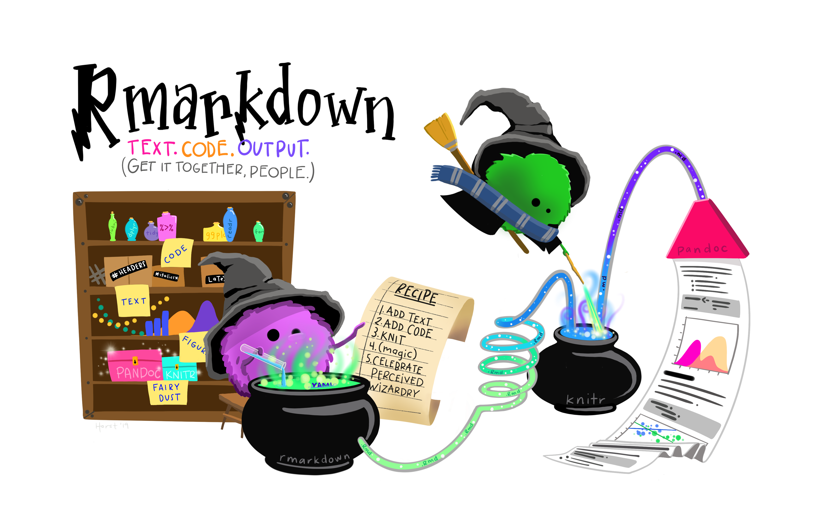

```{r setup, include=FALSE}
knitr::opts_chunk$set(
  comment = "#", fig.height = 3, 
  cache = FALSE,  collapse = TRUE,
  error = TRUE
)
```

CSI 2300: Introduction to Data Science

Lecture 03:  R Markdown 


## R Markdown




### Why use markdown? 

Markdown is a language that combines text and code and formatting wizardry. 
Most of your assignments for this class will require a pdf submission with code chunks that is generated from a R Markdown file. 
Markdown is the general markup language that allows you to add formatting to a basic text editor. (Markdown files have a .md extension.) 
R markdown is the particular flavor we will use that incorporates plain markdown with chunks of the R language to produce reports. 
(You can also use any other language besides R, say SQL or Python chunks.)

Markdown is incredibly useful for ensuring that your work is well-documented and reproducible.
Markdown incorporates the relevant data, any preprocessing, and the analysis directly in the script. 
It is useful in the corporate setting for running any recurring reports. 
It can also be used for personalized mail or reports (We won't cover this, but the `params` of your document are particularly helpful for this.)
You can also write academic documents like journal article or even a whole thesis. 
Beyond documents, you can create a wide range of fancy presentations (Check the `xaringer` package or `slidy`), whole books (Check `bookdown` package) or a website (Check `blogdown` package.)

### How to compile? 

Your .Rmd script we'll work out of in this class goes through several processing steps to render the fancy pdfs you'll submit. 
We say the .Rmd file is knit via the wizardry in the `knitr` package to produce a .md file. From the .md file, a pandoc is generated that can then be transformed to the output of your choice (probably a .pdf, but .html is also useful and knit to .docx if you must) 

There are several different ways to knit! 

- Knit button in the R Studio interface, hit the ball of yarn with the needle in it next to the Knit button!
- Keyboard shortcuts `Ctrl + Shift + K`  or `Cmd + Shift + K` on macOS
- If for some reason you need to render from the console, `rmarkdown::render()`
- If you are tired of repeatedly needing to check what's in another window, the moon_reader function from the xarigan package is quite useful `xaringan::inf_mr()`

#### Hold on a minute why can't I knit to pdf??     

Knitting to pdf requires an additional language to translate from pandoc to .pdf called LaTeX. 
It's largely used by mathematicians to type complicated maths from an editor. 
We will use it behind the scenes to make some pdfs. 
The most lightweight option to install LaTeX is by using the `tinytex` package managed by Yihui Xie. 
[TinyTeX](https://yihui.org/tinytex/) downloads just the essentials instead of the hefty versions (i.e. MiXTeX) ([more details here](https://bookdown.org/yihui/rmarkdown-cookbook/install-latex.html)). 

Copy and paste the lines below into the console in RStudio, restart your session, and give knitting to pdf a go!

```{r eval = FALSE}
install.packages('tinytex')
tinytex::install_tinytex()
# to uninstall TinyTeX, run tinytex::uninstall_tinytex() 

```


### YAML 


Your .Rmd file is made up of three languages, markdown, R, and another language called YAML. 
The YAML (“YAML ain’t markup language” or “Yet another markup language”) is the document information stored atop the R Markdown document, bounded on each end by `---`. 
When you first create a new .Rmd, that will look something like this:

```
---
title: "Document title"
author: "Author"
date: "MM/DD/YYYY"
output: html_document
---
```

We’ll leave it as-is for now, but know that this is where we can quickly set a number of options for the document related to output format, themes, layouts, and more.


### Code chunks

Code chunks are where we’ll add most code in an R Markdown document (though we’ll see later we can also add or refer to R code inline). There are a number of ways to add a code chunk, including:

+ Click on the `green + c` button in the top bar for the .Rmd, then choose R (or explore options for adding code in other languages)
+ In the menu, click Code > Insert Chunk
+ Use the shortcut (`Cmd + Option + I`) 
+ Just type in the start and end gates (```{r} to start, ``` to end)

Within a new code chunk, let’s add some code:

```{r, eval = FALSE, echo = TRUE}
plot(mtcars$wt, mtcars$mpg)
```


When we knit, the code and graph appear in the document, demonstrating that we can have our text, code and outputs all in the same place - and any outputs will automatically update when we change our code & re-knit.


#### Aside: chunk options

Chunk options are options designated in the code chunk header that determine what appears or does not appear for each chunk upon knitting (and a lot more, but we’ll start there…). For more information on code chunk options in R Markdown, see Chapter 11 in the R Markdown Cookbook.

Chunk options can be added to individual code chunk headers (within the `{r}` atop the chunk), or applied globally by adding options to the `{r setup}` code chunk at the top of the document.

Here are some common chunk options:

+ `echo = FALSE`: do not show the code in the knitted document
+ `include = FALSE`: do not include code or any outputs in knitted document
+ `message = FALSE`: suppress messages when knit
+ `warning = FALSE`: suppress warnings when knit
+ `eval = FALSE`: do not evaluate this code

### Cheatsheets 

[https://www.rstudio.com/resources/cheatsheets/](https://www.rstudio.com/resources/cheatsheets/.)

### Ouptut formats 

Markdown is useful for creating documents, books, blogs, and presentations. 
The mfain formats we will use in this class are: 

- `pdf_document` what most of the submissions will be for this class
- `html_document` the least likely format to cause you issues and useful for troubleshooting
- `word_document` if you're having trouble with pdf or insist on using Microsoft products
- `md_document` vanilla markdown, most often used if github is causing issues
- `github_document` if you want to publish markdow to github

Full list available [here](https://bookdown.org/yihui/rmarkdown/output-formats.html)

### Inline Code 
Often, we want to reference code outcomes within our text. For example, we may want to refer to a mean value, like:

  "The mean nitrate concentration in Lake A is 11.2 mg/L." 
The common option of copying and pasting values, however, is **tedious** and **dangerous**. A better way is to refer to code outputs directly, so that values are updated automatically when code or data change.

In R Markdown, we add code inline with a single back-tick (`) on either end, and a lowercase r between to start it.

Then we can insert code within our text, which under the hood contains this inline R code to calculate the mean gas mileage for all cars in the mtcars dataset:

```{r eval = FALSE}
r round(mean(mtcars$mpg, na.rm = TRUE), 2)

```


…to produce this output: “The mean gas mileage of cars in the dataset is 20.09 mm.”

Then, if our data or code ever change, so will our text output.

### Markdown syntax 

I highly suggest printing out the cheat sheet and having it on standby as you're learning markdown. 
There's also a quick reference in the R Studio help and a direct link to markdown references in the Help menu. 
Here's a quick list of formatting we can do in markdown: 

- headers with number of pound signs
- links with `[text](link)`
- footnotes `^[footnote]`
- unordered lists with `*` or `-` or `+` 
- numbered lists with `1. `
- Math expressions, for example: 
`$$f(k) = {n \choose k} p^{k} (1-p)^{n-k}$$` $$f(k) = {n \choose k} p^{k} (1-p)^{n-k}$$

**Hot tip:** if your formatting is not working as expected, chances are your spacing needs some adjustment. 
The headers, for instance, require blank space on either side. 
The lists also require a blank line before initiating.


## Resources

* The [R Markdown Cookbook](https://bookdown.org/yihui/rmarkdown-cookbook/) by Yihui Xie, Christophe Dervieux, Emily Riederer
* [R Markdown: the Definitive Guide](https://bookdown.org/yihui/rmarkdown/) by Yihui Xie, * J. J. Allaire, Garrett Grolemund
* Posit’s [R Markdown site](https://rmarkdown.rstudio.com/)
* Posit’s [R Markdown lesson](https://rmarkdown.rstudio.com/lesson-1.html) series
* Alison Hill’s workshop on [Advanced R Markdown](https://allisonhorst.github.io/udm-rmarkdown/)

### References

[Allison Horst's R Markdown for fun, functional and reproducible reporting] (https://allisonhorst.github.io/udm-rmarkdown/) 