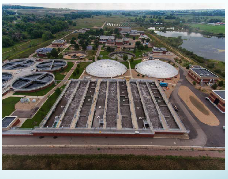
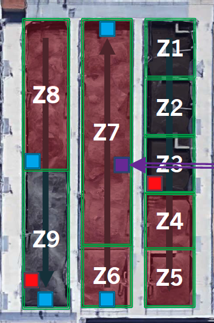
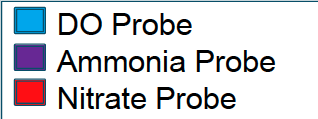

```{r setup, include=FALSE}
knitr::opts_chunk$set(
  comment = "#", 
  cache = FALSE,  
  collapse = TRUE,
  error = TRUE,
  tidy.opts=list(width.cutoff=80),
  tidy=TRUE
)
```

CSI 2300: Intro to Data Science

In-Class Exercise 06:  Exploratory Data Analysis


These are the packages that we'll need for today's exercises:

The data for today comes from the mowater package. You can install it by running the code below. You only want this chunk to run once, so after you have the package, set eval back to FALSE.


```{r load-packages, echo=TRUE, results="hide", message=FALSE}
library(lubridate)
```


The data for today's exercises come from the Boulder Water Resource and Recovery Facility.

First is a picture of the facility where the data are collected.  It shows three aeration basins together, and the next plot shows a diagram of the flow of water through one aeration basin.  The red highlighted basins are ``aerated," meaning that oxygen is being pumped by blowers into the sludge, and the other basins are not aerated.  One goal with this data is to try to predict ammonia in Zone 7. 

```{r the-data, include=TRUE}
load(file="dat/boulder_ammonia.rda")
```

{width=50%}
{width=25%}
{width=30%}


1. Look at the names of the  variables in the data file.  Using just the names, can you figure out what each of the variables is?  What is the naming convention used?

```{r}
data <- boulder_ammonia

dim(data) # How many observation I have

colnames(data)

#head(data)
```

2. Describe the type of each of the variables.

```{r}

summary(data)

#DATA IS QUANTITAVITE AND 
#CONTIUOUS 

```


3. How frequently are the measurements taken?


4. What are the first and last dates in the dataset?

```{r}

head(data$Date.Time) #2019-01-01
tail(data$Date.Time) #2019-03-31

min(data$Date.Time) #2019-01-01
max(data$Date.Time) #2019-04-01

```

5. Compute the mean, median, and standard deviation of the ammonia data. To identify observations that are unusual, people commonly compute the number of standard deviations away from the mean that an observation is.  Find the minimum and maximum values of ammonias, and compute the number of standard deviations these values are away from the mean.

```{r}

ammonia <- data$AB3.Z7.Ammonia.mg.N.L

mean(ammonia) #3.949557
median(ammonia) #3.45602
sd(ammonia) #2.752019

min(ammonia) #0.1103667
max(ammonia) #12.48557

min(ammonia) - max(ammonia)/sd(ammonia) #-4.426508

(max(ammonia) - mean(ammonia))/sd(ammonia) #3.101726

```


6. Compute the 1, 5, 10, and 90, 95, 99^th^ quantiles of ammonia.

```{r}

quantile(ammonia, c(0.01, 0.05, 0.1, 0.9, 0.95, 0.99))

```

       1%         5%        10%        90%        95%        99% 
 0.2933933  0.5134684  0.7636366  7.9711632  8.9596873 10.4291826 

7.  The way to obtain the hour associated with each observation is given below. Note that the hours are labeled as {0,1,2,...23}. Find the mean value of ammonia for each hour of the day.  The command `tapply()` could be useful here.  Do there appear to be differences in ammonia across the course of a day?  If so, why do you think that this could be occurring?

```{r}

hour <- hour(boulder_ammonia$Date.Time)

hour0 <- ammonia[which(hour==0)]

round(mean(hour0), 2) #mean at hour0 is: 3.48


#FOR LOOP:

mean_by_hour <- NULL

for (i in 0:23){
  mean_by_hour[i+1] <- round(mean(ammonia[which(hour==i)]), 2)
}

mean_by_hour <- tapply(ammonia, hour, mean)

plot(0:23, mean_by_hour, type = "l", xlab = "Hour", ylab = "Hourly Mean")
```

8. Compute the mean and standard deviation of the dissolved oxygen (DO) as you move from Zone 6 to Zone 9.  How does DO change as you move through the basin?

```{r}
mean(data$AB3.Z6.DO.mg.L)
mean(data$AB3.Z7.DO.mg.L)
mean(data$AB3.Z8.DO.mg.L)
mean(data$AB3.Z9.DO.mg.L)
```

As you move through the basin from Zone 6 to Zone 9, the dissolved oxygen levels decrease significantly, with the most pronounced drop occurring between Zone 7 and Zone 8, and reaching near-zero levels in Zone 9. This pattern indicates that the basin becomes increasingly oxygen-depleted as you move from the earlier zones (6 and 7) to the later zones (8 and 9).

9.  Both the mean and the median measure the center of a dataset. However, there can be differences between them. If a distribution is symmetric around its center, the mean and the median will be about the same. If the distribution is not symmetric, the mean will be drawn to the more extreme values.  Compare the mean and median of nitrate in both Zone 3 versus Zone 9. In which zone does the distribution of nitrate appear to be symmetric, based only on comparing their mean and median?


```{r}
mean(data$AB3.Z3.Nitrate.mg.N.L)
median(data$AB3.Z3.Nitrate.mg.N.L)

mean(data$AB3.Z9.Nitrate.mg.N.L)
median(data$AB3.Z9.Nitrate.mg.N.L)
```

Zone 3: The distribution of nitrate is not symmetric, as the mean is much higher than the median.

Zone 9: The distribution of nitrate is symmetric, as the mean and median are very close.


10.  How often is  ammonia  above 8 mg/L in this dataset?

```{r}
length(which(ammonia > 8))
length(ammonia)
```

Ammonia levels go above 8 mg/L in about 9.83% of the data. This means it happens less than 10% of the time, so it's not very common.


