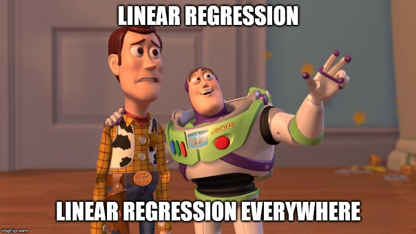

```{r setup, include=FALSE}
knitr::opts_chunk$set(
    echo = TRUE,
    cache= FALSE
)
```

{ width=30% }

Image source: [Marco Peixeiro, Towards Data Science](https://towardsdatascience.com/the-complete-guide-to-linear-regression-in-python-3d3f8f06bf8)

## Outline

In this lecture we'll discuss:

- What is a **linear relationship** between two variables?
    - We'll **construct** some data to illustrate a linear relationship.
- Using data to **infer** (find) a linear relationship with `lm()`.
    - Extract a linear relationship from the constructed data
    - Water temperature versus air temperature on Lake Ontario
- We'll **analyze** the linear model.


---

# What is a Linear Relationship?

This lecture covers data that are *linearly related*.

- That's just a way of saying that two variables (quantities) tend to move
  together.
- In particular, "linear" means that when one variable increases by a certain
  amount, the other variable increases by a *multiple* of the change in the
  first variable.
- Linear: think "straight line".

For example, let's think about the relationship between house *size* and *price*.

- Let's use variables $P$ and $S$ to represent price (in dollars) and size (in square feet).
- $P$ tends to increase with $S$ -- when the size increases, the price tends to
  as well.

The relationship might be something like:

$$ P = S * \$123 + \$10000 $$

In other words, the base price of any house is $10000 (this is called the
*intercept* of a linear model). Every additional square foot
adds $123 to the price (this is called the *slope* of a linear model). The fact
that the price is effectively a multiple of the size (plus a base price) is a
linear relationship.

# Creating Housing Data that has a Linear Relationship

Let's start by **creating** a very simple housing dataset.

- We'll construct data for two variables $S$ and $P$ that we *know* will have a
  linear relationship.
    - Because we are creating the relationship.
- First create data for $S$ over the range $300$ to $2000$ (square feet).
- Then create $P$ using the linear relationship we wrote above, and adding in a
  little bit of random noise.

```{r}
# create 30 values, evenly spaced between 300 and 2000
S <- seq(300, 2000, length.out=30)

# the underlying parameters of the linear model
slope <- 123
intercept <- 10000

# create a vector of prices with no noise
P_no_noise <- S * slope + intercept

# create a vector of prices with a small amount of noise
set.seed(101) # to get the same noise each time
small_noise <- rnorm(S, sd=10000)
P_small_noise <- P_no_noise + small_noise

# create a vector of prices with a large amount of noise
large_noise <- rnorm(S, sd=25000)
P_large_noise <- P_no_noise + large_noise

# some plotting data that we want to use multiple times and define only once
point_size <- 1.5 # slightly larger than the default
point_type <- 19  # filled-in circle
colors <- c("black", "purple", "blue", "red")
home_xlab <- "Home square feet"
home_ylab <- "Home price"

# plot all the data
plot(S, P_no_noise, xlab=home_xlab, ylab=home_ylab,
                         col=colors[1], cex=point_size, pch=point_type)
points(S, P_small_noise, col=colors[2], cex=point_size, pch=point_type)
points(S, P_large_noise, col=colors[3], cex=point_size, pch=point_type)

# add the underlying line that generated everything
abline(intercept, slope, col=colors[4])

legend("topleft", 
       legend=c("no noise", "small noise", "large noise", "generating line"),
       col=colors,
       pch=c(point_type, point_type, point_type, NA),
       lty=c(0, 0, 0, 1)
)
```

There is generally an upward trend -- as $S$ increases, so does $P$.  Again,
this is because we created this dataset, and created that relationship.  Notice
that when we add more noise, the prices are (vertically) further from the line.

<!---
Notice the line that says: `P <- S * slope + intercept + noise` - this creates a
linear relationship between the variables $S$ and $P$. As $S$ increases, $P$
increases at roughly $123$ times the rate.  We say "roughly" because we've also
added some noise (`rnorm`), as we might expect to see in real life (the price of
a house depends on factors other than just its size).
-->

This looks nice. Let's summarize what we have so far:

- We have some **made-up data** about housing size and price.
- We have a **line** that seems to fit the data reasonably well.
- The **slope** of the line is $123$, meaning that each square foot of a house 
  increases the average price by $123$ dollars.
- The **intercept** of the line is $10000$, meaning that a house with $0$ square
  feet (i.e. no house at all, just land) has an average price of $10000$
  dollars.
- We can use this line to make **predictions**.  That is, the dependent variable
  (price) can be estimated using the line and information about the independent
  variable (size).

## Independent and Dependent Variables

When we use a mathematical or statistical model to represent any kind of
variable relationship (not just linear relationships), we often call one
variable the **independent** variable, and the other variable the **dependent**
variable. Think of the names this way: the dependent variable **depends on** (or
is affected by) the independent variable.  Sometimes a dependent variable is
called a "target". In the example above, $S$ is the independent variable, and
$P$ is the dependent variable.

---

\newpage

# Reversing this Process -- Identifying the Linear Relationship from Data

In the above, we did the following:

- We *created* a dataset that has a linear relationship,
- plotted the data,
- and plotted a line that fits the data.

This was easy, because we controlled all the steps, and we knew what the linear
relationship was.

**The real point of this lecture is to do (in some sense) the reverse of this
process**. We want to:

- take some data that we did not create, 
- and infer (discover) what the linear relationship is between two variables.
    - We'll use **linear regression** with the R command `lm()` to do this.

## Example 1: Housing Size and Price

We'll start with the dataset we just created between housing size $S$ and price
$P$. We had three datasets (no noise, a little noise, a large amount of noise).
We'll use the dataset with a large amount of noise (rename it to `P` for
convenience). Let's make the assumption that we didn't know how the data was
generated, and use the R function `lm()` to find a "best-fit" line to the data.


```{r}
# rename the dataset for convenience
P <- P_large_noise

plot(S, P, xlab=home_xlab, ylab=home_ylab,
     col=colors[1], cex=point_size, pch=point_type)

# Now run lm(), with the model "P ~ S"
m <- lm(P ~ S)
# The variable m is an object called a *model* -- representing the relationship
# between the price and the size. 

# Plot the line that m represents on the same plot
colors <- c("blue", "red")
abline(m, col=colors[1])
abline(intercept, slope, col=colors[2])

legend("topleft", 
       legend=c("lm line", "generating line"),
       col=colors, lty=1)

# Display information about the model m
m
```

Note that the data (which are plotted as points) generally have a downward
trend, and the line that's plotted follows that trend. At least, as well as a
straight line can do.

A few questions and comments:

- What is this `P ~ S` syntax?
    - The tilde is the way we express a *formula* in R, in other words, a
      relationship like (e.g.) `P = S * slope + intercept`.
        - The intercept term is implicit (we don't specify it explicitly).
    - We have to tell `lm()` what are the dependent and independent variables,
      using this notation.
- What is `m`?
    - This variable is what we call a "model", which contains the information
      that `lm()` found 
- What do the coefficients mean?
    - They describe the slope and intercept for the linear relationship.
- What can we learn from the coefficients?
    - The estimated intercept is $8916.60.
    - The estimated slope is $120.90.
    - Why aren't these the same as the slope and intercept used to generate the
      data?
- What is `lm()` really  doing?
    - Finding a line which minimizes the (squared) vertical distance between the
      points and the line.
    - I.e. $\sum_{i=1}^n (p_i - y_i)^2$, where:
        - $n$ is the number of observations.
        - $p_i = x_i * a + b$ is the model prediction (the line) for slope $a$
          and intercept $b$ (the coefficients that `lm()` is finding).
        - $x_i$ is the independent variable.
        - $y_i$ is the dependent variable.

---

\newpage

### Example 2: Air and Water Temperatures at Lake Ontario 

For this example, we'll load in some external data from a website. The datasets
we will use represent the average air temperature and average surface water
temperature of Lake Ontario. The first three lines of each file should be
skipped (contain some comments we want to ignore).

```{r}
url <- 'https://www.glerl.noaa.gov/data/dashboard/data/hydroIO/temps/ontarioWaterTempModAnn.csv'
ontario_water_temp <- read.csv(url, skip=3, header=T)

url <- 'https://www.glerl.noaa.gov/data/dashboard/data/hydroIO/temps/ontarioLandAirTempMeanAnn.csv'
ontario_air_temp <- read.csv(url, skip=3, header=T)

# give a common name to the temperature columns
names(ontario_water_temp)[2] <- "Temp"
names(ontario_air_temp)[2] <- "Temp"

plot(ontario_water_temp$Year, ontario_water_temp$Temp,
     xlab="Year", ylab="Temperature (ºC)", col="blue")
points(ontario_air_temp$Year, ontario_air_temp$Temp, col="red")
legend("topleft", legend=c("Water", "Air"), col=c("blue", "red"), pch=1)
```

With this plot over time, it appears that there may be a relationship between
annual average water temperature and annual average air temperature, but we can
look at a scatterplot of one against the other to get a better idea.

```{r}
# The datasets use slightly different years; find out the common years.
common_years <- intersect(ontario_water_temp$Year, ontario_air_temp$Year)

# Now create datasets with only those years with the "%in%" operator.
water_temp <- ontario_water_temp$Temp[ontario_water_temp$Year %in% common_years]
air_temp   <- ontario_air_temp$Temp[ontario_air_temp$Year %in% common_years]

# now plot the air temperature versus water temperature, one point for each year
plot(air_temp, water_temp, xlab="Air Temperature (ºC)",
     ylab="Water Temperature (ºC)", main="Lake Ontario")

# use lm() to find a linear model between the two kinds of temperature
m <- lm(water_temp ~ air_temp)
# add a line to the plot
abline(m)

# display just the coefficients of m
coef(m)
```

What can we learn about the relationship of these two variables?

- They move together, in the same direction (since the coefficient `air_temp`
  is positive).
- The two temperatures changes at about the same rate (since the `air_temp`
  coefficient is about $0.9$, close to $1$).
    - Is this surprising?

---

\newpage

# Analyzing and Using the Model

Is the model that we have for temperature a **good** model? Does it capture the
relationship between the two variables?

```{r}
summary(m)
```

That's a lot of information. But notice a few things:

- The asterisks (stars) on the right of "(Intercept)" and "water_temp".
    - These indicate that there is a strong chance that these coefficients
      really are not zero (i.e. the intercept is not zero, and also the slope is
      not zero). 
    - So it's probable that there is a true linear relationship here.
- There are two quantities labeled "R-squared".
    - These tell how much of the variance of the dependent variable (`air_temp`)
      is predictable by the linear model.
    - R-squared values are always between $0$ and $1$; a higher value means that
      the model is a better fit.

## Looking at Residuals

The *residuals* of a regression tell us how far each plotted point was away from
the line. There are two ways of getting at this:

- Looking at them on a plot.
- Looking at their numeric values.

```{r}
temp_residuals <- residuals(m) # get their numeric values
head(temp_residuals) # look at a few

# plot the residuals
plot(m, which=c(1)) # the "which=c(1)" says "plot just the residuals plot"
```
