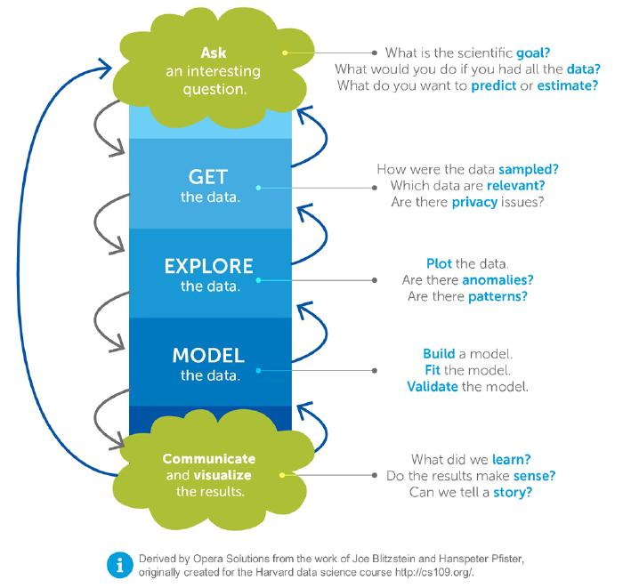

```{r setup, include=FALSE}
knitr::opts_chunk$set(
  comment = "#", fig.height = 3, 
  cache = FALSE,  collapse = TRUE,
  error = TRUE
)
```

# CSI 2300: Introduction to Data Science

## Lecture 10:  Data Wrangling 101

## Today's Topics 

## What is Data Wrangling? 
* Some motivation
* Basic principles
* Data science workflow
* Saving reformatted data

## How does wrangling fit into the data science work flow?


## Details of a wrangle for Eagle Mountain (next video)
* combining files
* reshaping tables
* new variables
* writing out a new data frame 


# Data Wrangling


"Wrangling the data," or taking it from its initial format to a useable form, can take more than half of a data scientist's analysis time.   Important principles of data wrangling are as follows:

1.  Never overwrite the original data.  Always preserve the original data.

2.  Create an R script that loads the original data, does any manipulation needed, and then produces a clean dataset.  This ensures **reproducibility.**

3.  Data should be arranged as follows:
    + Each variable in a column
    + Each observation in a row
    + Each value as a cell

***It is all about the data frames ... ***

In this course most "wrangled" data will be in the form of a data frame. Although for some irregular data sets this may not be possible.   


This step is just one  in an overall data science project workflow that begins with the birth of a problem and ends with an analysis that is communicated to someone else. It is important to realize that that the wrangling step is not a negative and onerous aspect of this process but more about translating the raw information collected into a form that is focused for answering specific questions. 

{width=60%}


Note that this diagram glosses over the important wrangling step in the GET box. 

* The process is iterative from beginning to end.

* **GET the data** can include collecting the raw data from original sources via

    + databases
    + crawling
    + streams
    + binaries
    + API


* **WRANGLE the data** which can include but is not limited to the following: 

    + reorganizing the data
    + transforming variables or recoding categorical data
    + identifying and removing/imputing NAs
    + renaming variables
    + averaging values (e.g., to a lower resolution time stamp)


* Visualizing tools are used extensively, beginning  in **EXPLORE the data** with examples such as

    + histograms
    + boxplots
    + scatterplots
    + time series plots

* **MODEL the data** based on the goal of the analysis

     + linear models
     + clustering
     + classification
     + forecasting
    


* **Communicate and visualize** the results, which can  include 

    + developing interactive apps
    + commenting and publicizing code 
    + making recommendations for future data collecting efforts


* The beginning and ending of the process requires subject-matter expertise.  The middle boxes are where statistical and computer science tools are used.

* Story-telling is taking an idea and turning it into a story that is compelling and that prompts people to take action.

Finally, in walking through this process it helpful to come back to one definition of a data scientist: 

Someone who knows more statistics than a computer scientist, more computer science than a statistician, and can explain their results to audiences that are neither  statisticians nor computer scientists.


***
**Example, Eagle Mountain Lake:**  This is an example of some of the steps needed to transform the Eagle Mountain Lake raw data into the dataset that you have used and that follows these standards.  When it is first downloaded from the website^[no longer active], each variable is saved in a different file.  Within each variable's file, the date and time stamp are in the second column, but then the variable's value for each depth is given in the next twenty-one columns.

```{r}
temp  <-read.csv(
  file = "dat/EagleMountain/temp_through_09_12_2019.csv", header=T)
DO    <-read.csv(
  file = "dat/EagleMountain/DO_through_09_12_2019.csv", header=T)
DOsat <-read.csv(
  file = "dat/EagleMountain/DOsat_through_09_12_2019.csv", header=T)
pH    <-read.csv(
  file = "dat/EagleMountain/pH_through_09_12_2019.csv", header=T)
cond  <-read.csv(
  file = "dat/EagleMountain/cond_through_09_12_2019.csv", header=T)

head(temp)

```


How should the data be arranged to meet the row-column-cell criteria?  There are measurements at 21 depths for each date-time stamp, so we want to repeat each date-time stamp 21 times, each one associated with a different depth.  Then, we have the date-time stamp in the first column, the depth in the second column, and the five variables in each of the  next columns.  It actually doesn't take very many lines of code to make this happen.  The steps are as follows:

* Read in the five separate .csv files.
* Repeat each entry of the time-date stamp 21 times (one for each depth).
* Create a sequence of the 21 depths.  Repeat this sequence for the number of unique time stamps present.
* Take the 21 columns of each variable, transpose it (flipping columns and rows), and create a single vector.
* Combine the time stamps, depths, and the five variables into a single data frame.

```{r}
##--------------------------------------
## Rearranging data to have variables
## in columns and observations in rows
## with depth as a new column
##--------------------------------------

#There are measurements at 21 depths for each date-time stamp.  
#We want to repeat each date-time stamp 21 times, each one 
#associated with a different depth.

new.Date.Time.col<-rep(temp[,2],each=21)

#Create a column of depths of the values {0, 0.5, 1.0, ..., 10.0}
#repeated for each observation.

depth<-seq(0,10,by=0.5)
new.depth.col<-rep(depth, dim(temp)[1])

#Reformat the variables so that they are in a single column.
#What does each of the commands in one of these lines do?

temp.one.col <- c(t(as.matrix( temp[ ,3:23])))
DO.one.col   <- c(t(as.matrix(   DO[ ,3:23])))
DOsat.one.col<- c(t(as.matrix(DOsat[ ,3:23])))
pH.one.col   <- c(t(as.matrix(   pH[ ,3:23])))
cond.one.col <- c(t(as.matrix( cond[ ,3:23])))

#Combine all columns into a data frame and rename them
all.data<-data.frame(DateTime = new.Date.Time.col, 
                     Depth = new.depth.col, 
                     Temp = temp.one.col, 
                     DO = DO.one.col, 
                     DOsat = DOsat.one.col, 
                     pH = pH.one.col, 
                     Cond = cond.one.col)

head(all.data)
dim(all.data)

##--------------------------------------
## Save the restructured data
##--------------------------------------

write.csv(all.data, file="dat/EML_through_09_12_2019.csv", 
          row.names = FALSE, col.names = TRUE)

save( all.data, file="dat/EML_through_09_12_2019.rda")
# list out contents of the directory
dir()
```


***

Once you have wrangled the raw data into a new, more user-friendly form, you will want to save it.  There are multiple options, as follows:

* The `write.csv()`  command will create a `.csv` file.  You then use the `read.csv()`  command to load the file in working memory. 

The  `write.csv()`  command takes as arguments a matrix or a data frame along with the file name and path to where the file will be saved.

* The `save()`  command will create a `.Rdata` file.  The `load()`  command is used to read the file back into working memory, but it cannot be assigned to anything, and you'll have to hunt a bit to see what the object is called in R's memory.  The `ls()`  command can be used to list all of the objects in working memory.

It also accepts as arguments a matrix or data frame with the file and file path.

* The `saveRDS()`   command will create a `.Rds` file with similar arguments `write.csv()`   and `save()`. The `readRDS()`  is used to read in a new `.Rds` file, and it can be assigned to an object name.  


