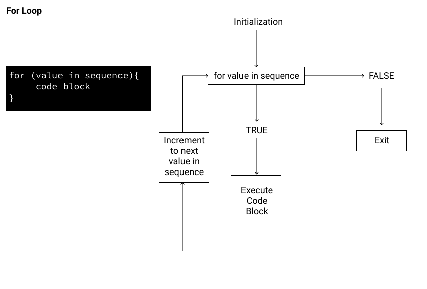

```{r setup, include=FALSE}
knitr::opts_chunk$set(
  comment = "#", fig.height = 3, 
  cache = FALSE,  collapse = TRUE,
  error = TRUE
)
```

CSI 2300: Introduction to Data Science

Lecture 12:  Basic Programming


<!-- \begin{center} -->
<!-- Lecture -->
<!-- \end{center} -->


# Today's Topics 

## The `which()` Command


## Finder  Commands


## The `for()` Loop


***


# The `which()` Command

So far, we have filtered datasets in multiple ways. We have used logical TRUE/FALSE vectors with either the `subset()` command or square brackets.  To review, here are some examples:
```{r}
#Reading in housing sale dataset
sales2019 <- read.csv(file="dat/boulder-2019-residential_sales.csv", header = T, stringsAsFactors = F)
#Getting rid of the commas and dollar signs
sales2019$SALE_PRICE <- gsub(",", "", sales2019$SALE_PRICE)
sales2019$SALE_PRICE <- as.numeric(gsub("\\$", "", sales2019$SALE_PRICE))

#(1) Using the `subset` command to select the data associated with specific cities.
city1 <- subset(sales2019, sales2019$CITY == "BOULDER" | 
                          sales2019$CITY == "LONGMONT" |
                          sales2019$CITY == "LAFAYETTE", 
                          select = c(SALE_PRICE, CITY))

#(2) Using a logical T/F sequence to select rows
top_cities <- (sales2019$CITY == "BOULDER") | 
              (sales2019$CITY == "LONGMONT") | 
              (sales2019$CITY == "LAFAYETTE")
city2 <- sales2019[top_cities, ]

```

Another approach that has been touched upon to identify the **row numbers** of interest is to use the `which()` command.   The main difference between using `which()` and just selecting those rows that satisfy a certain criteria is that the `which()` will return the row numbers instead of using a TRUE/FALSE sequence.  These row numbers are often referred to as the **index** of the row.  The benefit here is that it makes it a bit easier to perform the coding in two steps, and it makes it easier to verify that the filtering performed as you intended.

```{r}
#(3) Using which() to identify row numbers
top_index <- which((sales2019$CITY == "BOULDER") | 
              (sales2019$CITY == "LONGMONT") | 
              (sales2019$CITY == "LAFAYETTE"))
head(sales2019$CITY, 10)
city3 <- sales2019[top_index, ]
```


# Finder  Commands

Related to the `which()` commands are some commands that make finding and identifying unusual or special values very easy.  Let's see how each of these works.

* `identify()` 
* `locator()`
* `which.max()` and `which.min()`


```{r}

# identify() is interactive. You click your mouse on one or more points, 
# and when done, click escape.  Then, the row numbers/index of those points are shown.

plot(sales2019$ABOVE_GROUND_SQFT, sales2019$SALE_PRICE)
#special <- identify(sales2019$ABOVE_GROUND_SQFT, sales2019$SALE_PRICE)
#sales2019[special,]

# locator() is interactive, but must be applied to an existing plot. 
# You click your mouse on one or more points, and when done, click escape.
# Then, the x/y coordinates of those points are shown.


plot(sales2019$ABOVE_GROUND_SQFT, sales2019$SALE_PRICE, pch = 19, 
     col = rgb(0, 0, 0, 0.1))
#(xy_special <- locator())


# which.max() and which.min() return the index of the observation with either
# the largest or smallest value in the set.

which.max(sales2019$SALE_PRICE)
which.max(sales2019)  #Thus, can only be applied to one numeric variable at a time

which.min(sales2019$SALE_PRICE)
# sales2019[785,]
low_price <- which(sales2019$SALE_PRICE <= 5)
# sales2019[low_price, ]

```

\newpage

# The `for()` Loop

`for()` loops can be very helpful when you need to perform a task repeatedly.  They exist in most programming languages, but in R, the general thinking is to try to code without a loop, if possible, because loops can be slower than other options.  However, our computations will not be time-consuming, and learning to program loops is a useful skill.

Here is how we may visualize a loop conceptually.

{width=60%}


Here are some simple `for()` loops to help see the syntax in R.  Important components are:

* The condition is inside the parentheses after the `for`.
* The indexer or counter, oftentimes an `i`, `j`, or `k` is used.
* The curly braces begin and end the loop.
* The code in the body of the loop is executed on each trip.
* The indexer/counter is automatically increased by one after each trip.

```{r}
for(i in 1:10){
  
  print(i)
  
}

messages <- c("Happy Birthday", "Happy New Year", "Congratulations", "Super Job!", "Get Well Soon")
for(k in 1:length(messages)){

  print(messages[k])
  
}

```

In the next examples, you will see `for()` loops used in plotting, data wrangling, and in uncertainty analysis.

***

**Example, Plotting Data:**  Recall that in a prior exercise, you plotted the daily percent full of reservoirs for the years 2016 to 2020.  You may have done it like this:
```{r}

www <- "https://www.waterdatafortexas.org/reservoirs/statewide.csv"
water <- read.csv(file=www, header=T, skip=29)

suppressMessages(library(lubridate))

plot(1:365, seq(50, 100, len=365), type = "n", xlab = "", ylab = "")
water_year <- year(water$date)

lines(1:366, water$percent_full[water_year == 2016], col = 1)
lines(1:365, water$percent_full[water_year == 2017], col = 2)
lines(1:365, water$percent_full[water_year == 2018], col = 3)
lines(1:365, water$percent_full[water_year == 2019], col = 4)
lines(1:366, water$percent_full[water_year == 2020], col = 5)


```


However, those lines of code are very repetitive, and very little changes from one line to the next.  Furthermore, if you wanted to plot the last 50 years, then the above approach would not be very efficient.  This is a perfect situation in which to use a loop.

```{r}
plot(1:365, seq(50, 100, len=365), type = "n", xlab = "", ylab = "")
water_year <- year(water$date)

for(i in 2016:2020){
	
	one_year <- water[water_year == i, ]
	num_days <- nrow(one_year)
	lines(1:num_days, one_year$percent_full, col = 2021 - i)
	
}

```

Now, we may want to extend and plot the last 50 years, and it would be nice if the colors would change from one year to the next in a sensible way.

```{r}
suppressMessages(library(fields))
suppressMessages(library(viridis))

color_by_year <- color.scale(1971:2020, col = viridis(50))

plot(1:365, seq(50, 100, len=365), type = "n", xlab = "", ylab = "")

for(i in 1971:2020){
	
	one_year <- water[water_year == i, ]
	num_days <- nrow(one_year)
	#lines(1:num_days, one_year$percent_full, col = i)
	#lines(1:num_days, one_year$percent_full, col = color_by_year[i]) #No lines plot.  Why?
	lines(1:num_days, one_year$percent_full, col = color_by_year[2021 - i]) 
	
}

```


***

**Example, Replacing Missing Values:**  In this example, we'll use a `for()` loop to look for missing values in the raw Eagle Mountain Lake temperatures and then replace them with the average of prior and subsequent values at same depth.  The first step in constructing a loop is to test out the code for a single iteration.  Then, adapt it for stepping through a loop.

```{r}

temp <- read.csv(file = "dat/temp_through_09_12_2019.csv", header=T)

dim(temp)
colnames(temp)
variable.names<-c("Obs","DateTime","D0.0", "D0.5", "D1.0", "D1.5", "D2.0","D2.5","D3.0","D3.5","D4.0","D4.5","D5.0","D5.5","D6.0","D6.5","D7.0","D7.5","D8.0","D8.5","D9.0","D9.5","D10.0")
colnames(temp) <- variable.names

#This will hold the existing data and the imputed values.
#Important for not overwriting the raw data.
new_temp <- temp  

# Step (1)
# Initially looking at just the first column of temperatures

# summary(temp)
which(is.na(temp$D0.0))
missing <- which(is.na(temp$D0.0))
missing

temp_before <- temp[missing - 1, 3]
temp_after  <- temp[missing + 1, 3]
cbind(temp_before, temp_after)

imputed_values <- apply(cbind(temp_before, temp_after), 1, mean, na.rm = TRUE)

new_temp[missing, 3] <- imputed_values

# Step (2)
# Now, repeating this process for each column

for(i in 3:23){
  missing <- which(is.na(temp[, i]))
  # print(missing)

  temp_before <- temp[missing - 1, i]
  temp_after  <- temp[missing + 1, i]
 
  imputed_values <- apply(cbind(temp_before, temp_after), 1, mean, na.rm = TRUE)
  # print(imputed_values)
  new_temp[missing, i] <- imputed_values
}

# summary(new_temp)
```

***

**Example, Monte Carlo Analysis:**  A *Monte Carlo* analysis is one in which you sample repeatedly from a particular distribution and then perform some analysis of that distribution.  It gets its name from the principality of Monte Carlo, known in part for its casinos.  In a survey distribution to freshmen students at Mines enrolled in their first mathematics class, there were asked to "Mark one random spot inside of the square."^[Hering, A. S., Durell, L., Morgan, G. (2021) "Illustrating randomness in statistics courses with spatial experiments," *The American Statistician*, Now Online.]  These values were collected and can be plotted with the code below.

```{r}
suppressMessages(library(spatstat))
data <- read.csv(file="dat/dot_experiment_data.csv", header=T)
open 	<- which(data$type=="empty")
#Rescaling data to be on the unit square
x1 <- data$x[open]/15
y1 <- data$y[open]/15

plot(x1, y1, col = rgb(0, 0, 0, 0.35), pch=19, xlab="", ylab="", bty="n", xaxt="n", yaxt="n", asp =1)
lines(c(0,0),c(0,1))
lines(c(0,1),c(1,1))
lines(c(1,1),c(1,0))
lines(c(1,0),c(0,0))

win <- owin(c(0, 1), c(0, 1))
data_open <- ppp(x1, y1, window = win)  

#This computes the distance from each point to its nearest neighbors.
#Then, the median of these distances is computed.
open_nndist <- median(nndist(data_open))

#This is how you simulate 314 points distributed randomly inside of the unit square.
sim.dat <- runifpoint(314, nsim = 1) 
plot(sim.dat, main="", pch = 19, col = rgb(0, 0, 0, 0.1))

median_nndist <- NULL
B <- 1000

for(i in 1:B){
  
  sim.dat <- runifpoint(314, nsim = 1) 
  median_nndist[i] <- median(nndist(sim.dat))
  
}

hist(median_nndist, xlim=c(0.020, 0.032), 
     xlab = "Median Nearest Neighbor Distance", 
     main = "Monte Carlo Simulation", freq = F)
abline(v = open_nndist , col = "red", lwd = 2)
text(0.0223, 200, "Observed ", col = "red")
text(0.0225, 170, "Median NND", col = "red")

```

Thus, we can conclude that the observed median nearest neighbor distance for the points chosen by the students is very different than what would be expected if the 314 points were just randomly distributed throughout the square.

***


