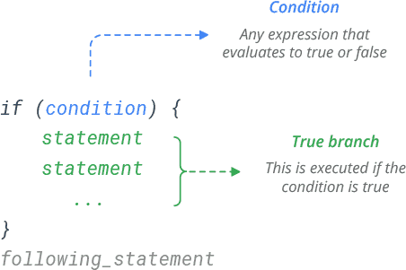
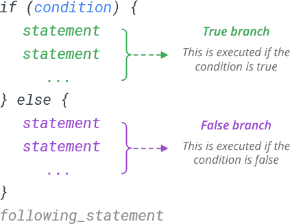

```{r setup, include=FALSE}
knitr::opts_chunk$set(
  comment = "#", fig.height = 3, 
  cache = FALSE,  collapse = TRUE,
  error = TRUE
)
```

CSI 2300: Introduction to Data Science

Lecture 13:  Iteration in R

<!-- \begin{center} -->
<!-- Lecture -->
<!-- \end{center} -->


# Today's Topics 

## If Statements
* Control Structures
* Common Syntax

## Loops
* While
  + Basics
  + Common Syntax
* For
  + Basics
  + Common Syntax


# Control Structures
When programming in almost every language (including R), we will want to control *when* and *how* certain chunks of code are to be run. Thankfully, within these languages **control structures** such as *if statements* and *loops* provide us with an easy to customize method which can be tailored depending on the situation they need to be applied. 

Control structures are blocks of code that determine how other sections of code are executed based on specified parameters. You can think of these as a bit like the instructions a parent might give a child before leaving the house:

“If you finish your dinner, you can have a desert.”

Control structures set a condition and tell R what to do when that condition is met or not met. And unlike some kids, R will always do what we tell it to! 


## Comparison Operators
In order to use control structures, we need to create statements that will turn out to be either TRUE or FALSE. In the previous 'kids' example, the statement “I've finished my meal, did I have desert?” yields TRUE (“Yes”) or FALSE (“No”). In R, the most fundamental way to evaluate something as TRUE or FALSE is through comparison operators (==, !=, <, >, <=, >=) in conjunction with logical operators (|, &).

# Syntax
## if statements
The basic syntax for 'if' statements is as follows:



If the condition within the '( )' evaluates to TRUE (or a non-ZERO numeric value), the code chunk within the '{ }' will be executed. If the condition evaluates to FALSE (or the numeric value of 0), then everything within the '{ }' will be skipped. 

```{r}

x <- 7
y <- 5

if(x > y) {
  print("x is greater")
}

```

One thing to note for future reference, if you only have a single statement to be executed within an 'if' statement, you do not HAVE TO have '{ }' around the executed code. 

```{r}

x <- 7
y <- 5

if(x > y) print("x is greater")

```

This tends to be a shortcut used by experienced programmers but one I do not recommend as it can lead to simple hard to find logical errors during execution.  

## if-else
So far we have only looked at what happens when the conditional is TRUE. To handle the situation when the first conditional is FALSE, we use the 'else' statement.



As stated previously, this will provide two paths within the 'if-else' statement. One branch for when the conditional is TRUE and one for when its FALSE. For example: 

```{r}

x <- 2
y <- 5

if(x > y) {
  print("x is greater")
} else {
  print("y is greater")
}

```

## Adding more branches
The 'if-else' syntax is perfectly fine when your choices are binary. However, rarely will your options ever present themselves in such a basic or simple manner, so we need a syntax that allows us many options (or branches) to control what code is executed depending on a complex choice. In this instance, the 'if-else-elseif' control structure (sometimes called the 'if-else Ladder') is the correct choice in such a scenario. 


Within R, you can use as many 'else if' statements as you want or need for a given situation, but over time, as you become a stronger programmer, when faced with a high degree of options I would recommend a 'switch( )' statement as a more efficient option. 

Extending our if statement example:

```{r}

x <- 3
y <- 3

if(x > y) {
  print("x is greater")
} else if (x < y){
  print("y is greater")
} else {
  print("x and y are equal")
}

```

One thing to be careful of when working with multiple branches like this is that once one of the branches evaluates to TRUE, then NONE of the subsequent code blocks within the conditional will execute. Even if their conditional would also evaluate as TRUE. For example: 

```{r}

x <- 3
y <- 3
z <- 10

if(x > y) {
  print("x is greater")
} else if (x < y){
  print("y is greater")
} else if (z > x) {
  print("z is greater")
} else if (x == y){
  print("x and y are equal")
}

```

As you can see in the previous example, even though the last conditional '(x == y)' evaluates to TRUE, it will not execute the associated code block due to the previous condition returning true and branching to the end of the 'if' statement. 

## Multiple Conditions
So far we have focused on fairly simple conditions for controlling the structure of the 'if' statements. However, we also know that the conditionals are not always simple, so we need the ability to extend these conditionals into more complex structures. To accomplish this we need to use logical operators (|, &, !) as a mechanism to chain a series of simple conditions into something more complex. 

```{r}

x <- 3
y <- 10
z <- 5

if(x > y & x > z) {
  print("x is greatest")
} else if (x < y & y > z){
  print("y is greatest")
} else {
  print("z is greatest")
}

```

NOTE: For those of you used to other programming languages, the logical operators (||, &&) will still work in R. 


# While Loops

A loop is a section of code used to repeat a specific set of instructions. In a previous video you learned about the 'for' loop and that it will repeat a certain set of times. 'While' loops on the other hand, will repeat instructions until a specific condition is met. 


```{r}

i <- 1

while (i < 6) {
  print(i)
  i <- i + 1
}

```

In the above example, i is initially initialized to 1.

Here, the conditional is i < 6, which evaluates to TRUE since 1 is less than 6. So, the body of the loop is entered and i is printed and incremented. Incrementing i is VERY important to ensure that the conditional will meet the exit condition. Failing to do so will result into an **infinite loop**.

In the next iteration, the value of i is 2, and the loop continues. This will continue until i takes the value 6. The condition 6 < 6 will give FALSE, and the 'while' loop finally exits.

One thing to note with 'while' loops is that if the condition returns FALSE at the start, the code within the '{ }' will not be executed at all.

```{r}

i <- 6

while (i < 6) {
  print(i)
  i <- i + 1
}

```

## 'Break'
One of the first questions asked when starting to work with 'while' loops is "is there a way to stop and exit the loop immediately, without going back to check the conditional?" The answer is "Yes*" where the asterisk denotes that a properly coded conditional should be able to handle any exit situation that you could want implemented. However, sometime when debugging your code, you might want to have some way to kick out of a 'while' loop without overly extending the base 'while' loop conditional. For this reason (and others) the 'break' statement was implemented, allowing you to jump out of the loop immediately. 

```{r}

i <- 1

while (i < 6) {
  print(i)
  i <- i + 1
  
  if(i == 4)  
    break
  
}

```


## 'Next' (or Continue)
In the same vein as the break command, the 'next' command allows you to skip the current iteration of a loop and move to the next one. As with break, a well designed conditional can make this kind of statement obsolete and considered bad form, but in the process of debugging your code, it can be useful. 
```{r}

i <- 0

while (i < 6) {
  i <- i + 1
  if (i %% 2 != 0)
    next
  print(i)
  
}

```


# For Loops
In order to maintain consistency, I am going to briefly go over the syntax and structure of the **for** loop. While I know this was covered in a previous lecture, I wanted to provide a 'one-stop-shop' approach for reference to these topics for later use. 

R's version of the 'for' loop is a bit of an anomaly. For those of you with computer programming experience, you may think that you have a clean grasp on this concept. However, unlike in other languages where the *for loop* iterates over a numeric progression, the *for loop* in R iterates over the items of a vector (or list). The iteration ordering is based on the order that items appear in the vector.  


```{r}

# Create fruit vector
fruit <- c('Apple', 'Orange', 'Passion fruit', 'Banana')
# Create the for statement
for ( i in fruit){ 
 print(i)
}

```

One of the basic usages for a 'for' loop would be to iterate through all of the members of a given vector. As seen in the above case, each time through the loop we access the 'i'th item and print to the console. This can be very useful in terms of searching through vectors or performing alterations to a vector.  In fact, we can also use a 'for' loop to create data, even in complicated data like a list, if we want. 

```{r}

# Create an empty list
list <- c()
# Create a for statement to populate the list
for (i in seq(1, 4, by=1)) {
  list[[i]] <- i*i
}
print(list)

```

We can even loop over complex list elements using a 'for' loop: 

```{r}

# Create a list with three vectors
fruit <- list(Basket = c('Apple', 'Orange', 'Passion fruit', 'Banana'), 
          Money = c(10, 12, 15), purchase = FALSE)
for (p in fruit) 
{ 
	print(p)
}

```

## Nested For Loops
Loops, by themselves, are quite powerful and can be used in various ways to achieve some very complex tasks. However, they do not have to be used by themselves. In fact, combining loops can result in some very useful mechanisms when working with greater dimensional data. To accomplish this, you need to create a loop inside another loop. For example: 

```{r}

for(x in 1:4) {
  for(y in 1:3) {
    print(paste("Value of x is ", x, " and value of y is ", y, ".", sep = ""))
  }
}

```

As you can see in the output, each iteration of the 'outer' loop results in a complete execution of the 'inner' loop. This can be extended as many times are you can logically require (or follow). 

Note: Images care of [learnbyexample.org](https://www.learnbyexample.org/)


