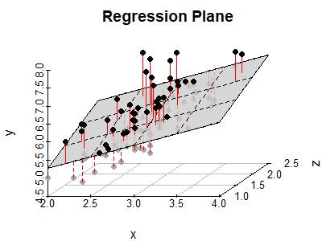

<!-- HTML style -->
<style>
    .main-container {
        /* widen the view */
        max-width: 1400px;
        margin-left: auto;
        margin-right: auto;
    }

    body {
        /* increase the font size */
        font-size: 150%;
    }
</style>

```{r setup, include=FALSE}
knitr::opts_chunk$set(
    echo = TRUE,
    cache= FALSE,
    fig.align="center",
    out.width="95%"
)
```

```{r, echo=F}
# load in the dataset...
suppressMessages(library(mowateR))
data(eml)
eml_small <- eml[1:1000,]
```

## Outline

In this lecture we'll discuss linear regression with multiple independent
variables.

- Why multiple independent variables?
- What does the mathematical model look like?
- How should we understand the model?
- Pitfalls to avoid

\ 

## Multiple Independent Variables

The world is not simple, one-to-one. That is, there are usually multiple
influences for something. I love Mexican food, but the probability that I'm
going to eat it on any given day (my dependent variable) has **multiple**
influences (independent variables), including:

- When was my last meal?
- What time of day is it?
- Where am I physically located?

So I may want to include all of those things in predicting my likelihood to eat
Mexican food soon.

\ 

Suppose we're trying to understand the dissolved oxygen (DO) content in Eagle
Mountain Lake. In the past, we've constructed the linear model which we
expressed in R as `DO ~ pH`. This model has two parameters: a slope (for pH) and
an (implied) intercept. In other words:

$$DO = \text{slope} \cdot pH + \text{intercept}$$

(When we run `lm(DO ~ pH, data=eml)` to construct a linear model, it is fitting
a line to that model by finding the best two parameters for the observed data.
Recall that the best fit is defined as minimizing the squared distance between
each example and the regression line.)

**But is pH the only influence? Probably not.**

```{r, fig.align="center", fig.dim=c(8, 3), out.width="80%", echo=F}
par(mfrow=c(1, 2))
plot(DO ~ pH, data=eml_small, xlab="pH level", ylab="Dissolved Oxygen (mg/L)", main="Eagle Mountain Lake", pch=19, col=rgb(0, 0, 0, 0.2))
m_ph <- lm(DO ~ pH, data=eml_small)
abline(m_ph, col="red", lwd=3)

plot(DO ~ Depth, data=eml_small, xlab="Depth (m)", ylab="", main="Eagle Mountain Lake", pch=19, col=rgb(0, 0, 0, 0.2))
m_depth <- lm(DO ~ Depth, data=eml_small)
abline(m_depth, col="red", lwd=3)
```

From these plots, we can see that **both** pH and Depth have some correlation
with DO. The correlation between DO and Depth makes sense -- oxygen is less
prevalent in deeper water which is under more pressure.

How can we understand how pH and Depth both affect DO?

\ 

## Multiple Regression Combines Independent Variables

We can construct a linear regression model that uses more than one independent
variable!  Let's move from one to two independent variables.

- In R: `DO ~ pH + Depth` (the intercept is still implied)
- In math: $DO = \text{slope1} \cdot pH + \text{slope2} \cdot Depth + \text{intercept}$

Note that since we have two independent variables and one intercept, we now have
**three** parameters (which we called "slope1", "slope2", and "intercept") that
the linear model must fit.


```{r}
(m_ph_depth <- lm(DO ~ pH + Depth, data=eml_small))
```

\ 

## What does this look like?

- Is it a line?
- Is it a bird?
- No, it's a **plane**!

For a regression model with $2$ independent variables, the regression model is a
$2$-dimensional plane, rotated and shifted by the three coefficients. We can
view this in three dimensions (two for the independent variables, a third for
the dependent variable).

```{r, output=F, echo=F}
# construct the prediction plane - first, two sequences that span the independent variables
resolution <- 15
pH <- seq(min(eml_small$pH), max(eml_small$pH), length=resolution)
depth <- seq(min(eml_small$Depth), max(eml_small$Depth), length=resolution)

# next, construct the predicted values at each pH/depth pair
f <- function(p, d) {
    m_ph_depth$coefficients[1] + p * m_ph_depth$coefficients[2] + d * m_ph_depth$coefficients[3]
}
predicted_do <- outer(pH, depth, f)

# finally construct the plot
persp(pH, depth, predicted_do, theta=-25, phi=15, col="lightblue", expand=0.5)
```

You'll notice that there's a lot of change in DO as pH changes, but very little
as Depth changes. That's because their coefficients have very different values.

\ 

And here's an (example stolen from the web) showing the residuals. The residuals
still represent exactly the same idea as when we had a straight line: they are
the distance of the dependent variable from its observed value (a black point) to
its predicted value (the plane).

{ width=80% }


## Even More!

We can do even more interesting things with multiple regression.

- we can use more than two independent variables
- we can do more than add them together -- we could multiply them, e.g.

However, when moving beyond our original (simple) model with one independent
variable, it becomes increasingly hard to visualize what's going on. That makes
it hard to see when things are correct (or not). So it's important to gain some
intuition for what's really going on with multiple regression (or any model we
use). We need to check the values going in and out of our models and make sure
they make sense.

## Pitfalls (and Good Practices)

One common mistake that we can face with multiple regression is called
**collinearity** or **correlation** between two (or more) independent variables.
That's when two independent variables are either the same, or represent the same
information but in different ways. They don't have to be identical. A simple
example is measuring the temperature in both Celsius and Fahrenheit, and
plugging both in as independent variables.

**Rule of thumb**: use independent variables that are **uncorrelated** (aka
"orthogonal") with *each other*, but *are* correlated to the dependent variable.
That is, independent variables should predict each other as little as possible,
but should help predict the dependent variable.

\ 

### An (Un-)Motivating Example -- What Not To Do

The EML data has an example of correlated variables: DO and
DOsat. Let's look at them again:
```{r}
plot(DO ~ DOsat, data=eml_small, xlab="Dissolved Oxygen Saturation", ylab="Dissolved Oxygen (mg/L)", main="Correlation between two variables", pch=19, col=rgb(0, 0, 0, 0.2))

# we can also measure their correlation numerically
cor(eml_small$DO, eml_small$DOsat)
```
This is very close to $1$. They are very highly correlated.

\ 

Let's turn the tables (for the sake of this example) and show what happens if we
were to treat DO and DOsat as independent variables, with pH as the dependent
variable. This is only so that we can show the effect of correlation.

```{r}
# use only DO as the independent variable
m_do <- lm(pH ~ DO, data=eml_small)
summary(m_do)

# use both DO and DOsat as the (correlated) independent variables
m_do_dosat <- lm(pH ~ DO + DOsat, data=eml_small)
summary(m_do_dosat)
```

As you can see, the coefficient for DO went down when we added DOsat: from
`r round(m_do$coefficients[2], 2)` to 
`r round(m_do_dosat$coefficients[2], 2)`.
Further, the coefficient for DOSat is slightly negative, so it's offsetting the
decrease in the coefficient for DO. Finally, notice that the coefficient for
DOsat is **not** statistically significant. Again, this is due to correlation.

### Coefficient Variation due to Correlation and Random Samples

If we were to try this
correlated-independent variable experiment multiple times with different
randomly selected subsets of the data, we would likely get the coefficients to
vary quite a bit (again just due to the randomness of the data selected, and the
correlation). Here's that experiment with three (intentionally) small subsets of
the EML data:

```{r}
for (i in 1:3) {
    eml_test <- eml[sample(nrow(eml), 20),]
    m_single <- lm(pH ~ DO, data=eml_test)
    m_multiple <- lm(pH ~ DO + DOsat, data=eml_test)
    print(paste("test ", i))
    print(m_single$coefficients)
    print(m_multiple$coefficients)
}
```

If you look carefully, you'll notice that the coefficients for `m_multiple`
(with correlation) are changing a lot more than the coefficients for `m_single`
(without correlation).


