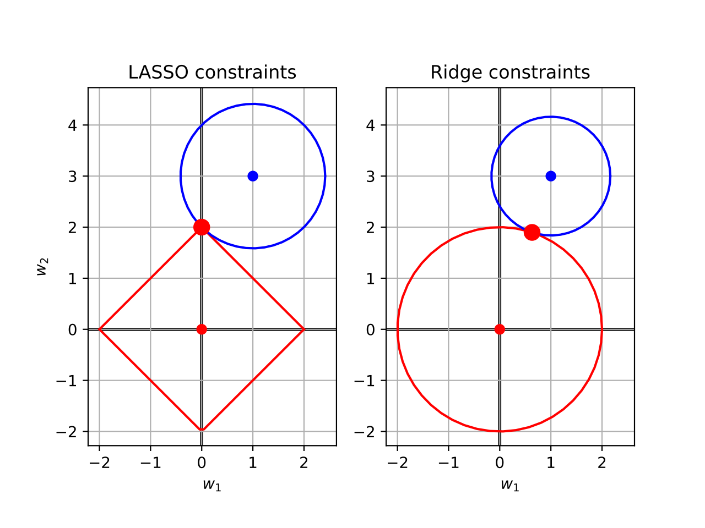

<!-- HTML style -->
<style>
    .main-container {
        /* widen the view */
        max-width: 1400px;
        margin-left: auto;
        margin-right: auto;
    }

    body {
        /* increase the font size */
        font-size: 150%;
    }
</style>

```{r setup, include=FALSE}
knitr::opts_chunk$set(
    echo = TRUE,
    cache= FALSE,
    fig.align="center",
    out.width="75%"
)
```

```{r, echo=F}
# get reproducible random results
set.seed(1)
```

## Outline

In this lecture, we'll look at how to select the independent variables that are
best for modeling. We'll look in particular at:

- How to think about relevant and irrelevant variables
- Stepwise method of variable selection (forward and backward)
- Penalized regression methods (LASSO and Ridge regression)

## Motivation -- Which Variables should I use?

Suppose that I would like to go for a run (outdoors), and I want to predict
whether today is a good day for doing that. I could use data to help me make
that decision. If I gathered observations about all of the following, which of
them do you think would be relevant to my decision?

- Weather-related:
    - temperature
    - wind speed
    - humidity
- Time-related:
    - the day of the year
    - the time I woke up today
- Other:
    - the amount of memory in my computer
    - the futures price of rice

Your experience might tell you that the weather-related variables seem very
relevant. The two time-related variables are possibly relevant (but not clearly
so). The last two are probably completely irrelevant.

The point is: just because we *can* measure something does not mean that we
*should*. We should not include all possible independent variables hoping for a
predictive model. 

**We need to be careful to select good independent variables, and avoid
irrelevant variables.**

\ 

## Why Are Irrelevant Variables Bad?

Or: **What's the Worst that Could Happen?**

Quick answer: irrelevant variables can harm our model.

```{r}
# load some data, and add some irrelevant variables
suppressMessages(library(mowateR))
data(eml)

# select the dependent variable (DO) and two relevant independent variables
relevant <- subset(eml,select=c(DO, Depth, pH))
num_relevant <- ncol(relevant) - 1 # DO is not an independent variable

num_irrelevant <- 5
noise_multiplier <- 0.10
irrelevant <- as.data.frame(matrix(rnorm(nrow(eml) * num_irrelevant) * noise_multiplier,
                                nrow(eml), num_irrelevant))

# join together the columns of the relevant and irrelevant variables
all_data <- cbind(relevant, irrelevant)

# for this example, limit the amount of data we're using to increase the effect
n <- 30 # use only a small amount of data
selected <- sample(1:nrow(eml), n)
# create a subset of the data with the selected sample
y <- eml[selected,"DO"]
small_data <- all_data[selected,]

# create a place to store the coefficients and r2 values
all_coefficients <- matrix(0, num_irrelevant + 1, num_relevant + num_irrelevant)
colnames(all_coefficients) <- colnames(all_data)[-1]
r2 <- array(0, num_irrelevant + 1)
adjusted_r2 <- array(0, num_irrelevant + 1)

# add in irrelevant variables, one by one
for (i in 0:num_irrelevant) {
    # create a matrix with all relevant variables and i irrelevant variables
    X <- small_data[,1:(1+num_relevant+i)] # 1+ means include DO
    # "DO ~ ." means "use DO as the dependent variable, and all other variables
    # as independent"
    m <- lm(DO ~ ., data=X)

    # store all the coefficients (except the intercept)
    all_coefficients[1+i,1:(num_relevant + i)] = m$coefficients[-1]
    r2[1+i] <- summary(m)$r.squared
    adjusted_r2[1+i] <- summary(m)$adj.r.squared
}

# inspect the results
round(all_coefficients, 2)
round(r2, 2)
round(adjusted_r2, 2)
```

\ 

We notice several things from this example. As the number of irrelevant
variables increases:

- The **coefficients for the relevant variables are not reliable**; they
  fluctuate.
- The **coefficients for all variables fluctuate** -- and can even change sign!
- The **un-adjusted** $R^2$ **increases** -- indicating that we are somehow
  getting a better fit with irrelevant variables. This doesn't make sense.
- The **adjusted** $R^2$ **does not increase as quickly as $R^2$** -- which is a
  warning to us that these extra variables are not actually helping our model
  fit. This tells you to pay more attention to adjusted $R^2$ than un-adjusted
  $R^2$.

The point is: irrelevant independent variables are worse than irrelevant;
**irrelevant variables actually harm our model's fit**.  Including them causes
the model to try to find a fit to irrelevant information -- often called
**noise**.  We do **not** want to do that!  We can be misled if we just pay
attention to $R^2$ fit values.

## How Can We Identify Good Independent Variables?

We mentioned a couple of ideas in the previous lecture. A good independent
variable should be **correlated** with the dependent variable, and
**uncorrelated** with other independent variables.

- All of the independent variables we just used were uncorrelated with each
  other (they were just random values)
- Only the relevant variables were correlated with the dependent variable.

```{r}
## correlation between y and all independent variables
round(cor(y, relevant[selected,]), 2)
round(cor(y, irrelevant[selected,]), 2)
indexes <- 1:ncol(all_data)
image(indexes, indexes, cor(small_data), axes=F, xlab="", ylab="")
axis(2, at=indexes, labels=colnames(small_data), las=1, tick=F)
axis(3, at=indexes, labels=colnames(small_data), las=1, tick=F)
```

As we can see, the relevant variables are correlated with y, but the irrelevant
variables are not. And no pair of different independent variables are strongly
correlated with each other.

\ 

## Stepwise Variable Selection

A simple technique for choosing variables is to use either **forward** or
**backward stepwise selection**. The ideas behind these two methods are similar:
keep adding (for forward) or removing (for backward) variables until the model's
fit no longer significantly improves (for forward) or gets worse (for backward).

### Important Questions

**How can we measure whether adding a variable helps?**

- We don't compare $R^2$ values -- we saw earlier how the non-adjusted $R^2$
  tends to go up (improve) with additional independent variables.
- Instead, we use something called a *penalized likelihood* -- an approximate
  measure of how well the model fits the data (the negative log likelihood),
  penalized by a measure of how many coefficients there are to estimate.
    - The negative log likelihood is a measure of fit (in some sense like
      $R^2$), but where lower is better.
    - The penalty is adding the number of coefficients in the model.
- Two popular penalized likelihoods are:
    - The AIC (Akaike Information Criterion)^[https://en.wikipedia.org/wiki/Akaike_information_criterion], and
    - The BIC (Bayesian Information Criterion)^[https://en.wikipedia.org/wiki/Bayesian_information_criterion]

\ 


**How do we know which variable to add or remove next?**

- Try adding (or removing) each variable to (or from) the current model.
- Measure the penalized likelihood.
- Choose the variable that improves the penalized likelihood the most.

\ 

**How do we know when to stop?**

Either we run out of variables to add/remove, or adding/removing a variable does
not improve the penalized likelihood score.

### The Stepwise Algorithms

Let's assume we have a dependent variable $y$ and a set of independent variables
$x_1, x_2, \ldots, x_k$. We want to select a subset of the $x_i$ variables that
predicts $y$ well.

Forward Stepwise Selection:

- Start with a very simple model, e.g. `y ~ 1` (i.e., $y$ has only an
  intercept).
- Let $X$ initially contain all of the $k$ independent variables
- While we have not converged and $X$ is not empty:
    - Rank all $x_i \in X$ for how well adding $x_i$ would improve the model
    - Let $x^*$ be the best independent variable to add.
    - If adding $x^*$ would improve the current model:
        - Add $x^*$ to the model
        - Remove $x^*$ from $X$
    - Otherwise, stop.

\ 

Backward Stepwise Elimination:

- Start with a very complex model, e.g. `y ~ x1 + x2 + ... + xk` (e.g. all
  independent variables).
- While we have not converged:
    - Rank all $x_i$ in the model for how well removing $x_i$ would improve the model
    - Let $x^*$ be the best independent variable to remove
    - If removing $x^*$ would improve the current model:
        - Remove $x^*$ from the model
    - Otherwise, stop.

## Example of Stepwise Variable Selection

In R, we use the `step()` command to do stepwise variable selection.  Let's
return to the EML example again. Here we'll use a bit more of the data.

```{r}
# backward selection -- start with the full model ("DO ~ ." means "use all
# independent variables in the data frame")
full_model <- lm(DO ~ ., data=all_data)

# step backward; the "k=log(n)" means "use BIC instead of AIC"; the BIC
# penalizes complex models (irrelevant variables) more than the AIC.
step(full_model, direction="backward", k=log(n))

# forward selection -- start with the smallest model (intercept only prediction)
small_model <- lm(DO ~ 1, data=all_data)
# step forward, again with the BIC ("k=log(n)"). Note the
# "scope=formula(full_model)" which tells step() which additional variables to
# consider.
step(small_model, direction="forward", scope=formula(full_model), k=log(n))
```

Note that in this example, both forward and backward selection chose the same
model. But this is a coincidence; it's not always going to happen!  Both methods
are "greedy" -- they are building models one variable at a time, without
reconsidering past choices.

There is also the option of doing "all subsets" variable selection -- given $k$
independent variables, try all $2^k$ subsets of them (and choose the best model
according to a penalized likelihood like AIC or BIC). But this can be costly
when $k$ is large.

# Penalized Regression: LASSO and Ridge

Another method of choosing variables is to use a **penalized** regression model.
We used a "penalized" method earlier (with AIC and BIC), where the penalty was
based on the *number of coefficients*. In LASSO and Ridge regression, we use a
penalty on the *values of the coefficients*. 

- A coefficient with value $0$ is like eliminating the corresponding variable
  from the model.
- Large coefficient values need to be justified by giving better model fit.

**The Point Is**: both LASSO and Ridge regression use *all* the variables,
but *penalize large coefficient values*. Hopefully this requires some of the
coefficients to be (effectively) zero. *A coefficient of zero implies we might
be able to eliminate the variable*.

## The Math behind Penalized Regression

Suppose that we have a model with $k$ independent variables $x_1, \ldots, x_k$
and $k+1$ coefficients $w_0, w_1, \ldots, w_k$ ($w_0$ is for the intercept).
Recall that the standard linear regression model chooses the $w_i$ values to
minimize the following ("least-squares"):

$$\sum_{i=1}^n (y_i - \hat{y_i})^2$$

where $\hat{y_i} = w_0 + w_1 x_1 + \ldots + w_k x_k$ is the model's prediction.

LASSO and Ridge regression both minimize the *same* least-squares function, but
also add a constraint:

- LASSO: minimize $\sum_{i=1}^n (y_i - \hat{y_i})^2$ subject to this constraint: $\sum_{j=1}^k |w_i| \le t$.

- Ridge: minimize $\sum_{i=1}^n (y_i - \hat{y_i})^2$ subject to this constraint: $\sum_{j=1}^k w_i^2 \le t$.

Note the difference: a sum of absolute values, versus a sum of squared values.
Also, note that we have to pick the limiting value $t$.  Here's a picture of a
way to think about the constraints in the *coefficient space*.

{ width=80% }

We can think of the LASSO as using a diamond-shaped constraint space, and Ridge
as using a sphere-shaped constraint space, as seen above. On each plot:

- the red diamond and circle indicate the constraints;
- the blue dot indicates the un-penalized least-squares fit (what `lm()` would
  give);
- the blue circles indicate a constant value of $R^2$;
- the large red dots indicate the coefficient values that each penalty would
  choose.

Note that the LASSO penalty chooses $w_1 = 0$, while Ridge has non-zero values
for both $w_1$ and $w_2$.  The difference in these shapes (diamond vs. sphere)
causes different penalization behavior. You can reason geometrically that the
diamond shape of LASSO tends to cause it to choose more coefficient values as
exactly $0$ (compared to Ridge regression), as we'll see again later.


## Enough Math, Let's LASSO that Ridge

In R, we can use the `glmnet` and `cv.glmnet` functions for both LASSO and Ridge
regression.  Fortunately, it will search over many values of $t$ mentioned
above, but for (*complicated reasons about mathematical duality*), we will refer
to a complementary value called $\lambda$. All you need to know is: 

- lower $t$ implies higher $\lambda$, and vice-versa;
- lower $t$ (higher $\lambda$) is more constrained (pushes the coefficient
  values closer to $0$)

We'll use the `cv.glmnet` method, which searches over many $\lambda$ values, and
chooses what it thinks is the best, using a technique known as
*cross-validation*. We'll learn more about cross-validation later in the
semester.

```{r}
suppressMessages(library(glmnet))

# don't make predictions based on these variables
leave_out <- which((colnames(eml) == "DO") | (colnames(eml) == "DOsat") | (colnames(eml) == "Date.Time"))

# create our independent variables (x) and dependent variable (y)
irrelevant <- matrix(rnorm(nrow(eml) * 5), nrow(eml), 5)
colnames(irrelevant) <- paste("i", 1:5, sep="")
x <- cbind(as.matrix(eml[,-leave_out]), irrelevant)
y <- eml$DO

lasso_fit <- cv.glmnet(x, y)
coef(lasso_fit)
```

The `lasso_fit` object is complicated. The `cv.glmnet` method tries many values
of $\lambda$ using cross-validation ("cv"). But if we call `coef(lasso_fit)`, it
selects the one for `lasso_fit$lambda.1se`, (1se means one standard error) which
is the largest value of $\lambda$ which achieves a close-enough error to the
model that used almost all coefficients. Put another way, it is the simplest
model that is still getting low error.

Note that the LASSO fit eliminated all five irrelevant variables, and also
`Temp`.

```{r}
plot(lasso_fit)
```

This shows how the mean squared error (MSE), which is an average of the SSR,
changes as we increase $\lambda$. The minimal $\lambda$ and the 1-standard error
$\lambda$ are plotted with vertical dotted lines. Above the plot shows how many
coefficients are non-zero.

Here's an example of how to make predictions and compute the residuals for the
selected LASSO model.

```{r}
lasso_predictions <- predict(lasso_fit, x)
lasso_residuals <- lasso_predictions - y
plot(y, lasso_residuals, pch=19, col=rgb(0, 0, 0, 0.1), xlab="DO", ylab="Residual",
     main="Residuals of LASSO fit")
```

Lastly, if you want to extract the coefficients and/or predictions for a
*different* lambda, you can add the argument `s=lambda`, where `lambda` is the
value you want to the calls `coef` and `predict`.

\ 

Here is the same sort of information for Ridge regression.

```{r}

ridge_fit <- cv.glmnet(x, y, alpha=0) # alpha=0 implies Ridge regression
coef(ridge_fit)
plot(ridge_fit)

ridge_predictions <- predict(ridge_fit, x)
ridge_residuals <- ridge_predictions - y
plot(y, ridge_residuals, pch=19, col=rgb(0, 0, 0, 0.1), xlab="DO", ylab="Residual",
     main="Residuals of Ridge fit")
```

There are several things to note here:

- LASSO was able to completely eliminate the fake irrelevant variables.
    - Ridge gave the irrelevant variables coefficient values close to $0$.
- LASSO completely eliminated `Temp`, while Ridge again gave it a fairly small
  coefficient value.
- As $\log(\lambda)$ increases, that increases the penalty for model complexity
  (large coefficient values), which forces the models to reduce their
  coefficient values, which makes for slightly worse fits in terms of
  Mean-Squared Error (which is an average of SSR, which we've seen before).

