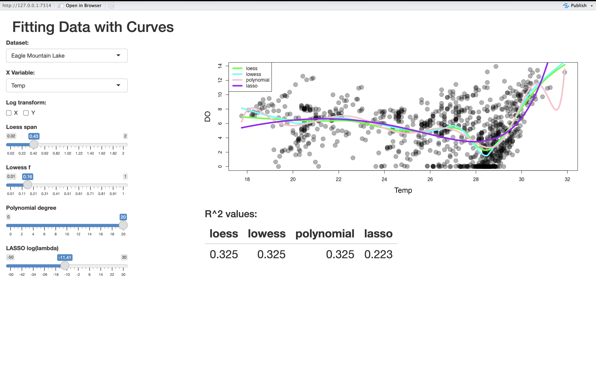
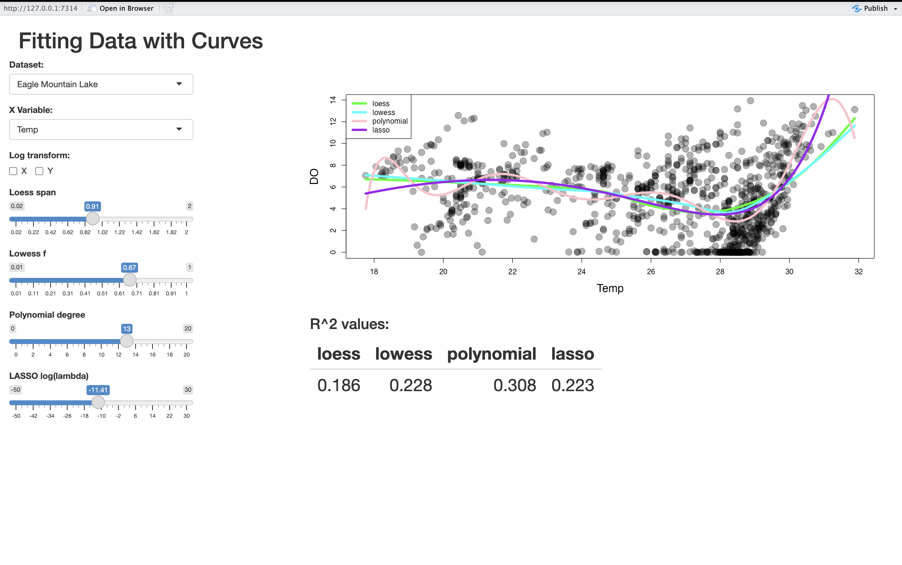

```{r setup, include=FALSE}
knitr::opts_chunk$set(
  comment = "#",
  cache = FALSE,
  collapse = TRUE,
  error = TRUE,
  tidy.opts=list(width.cutoff=65)
)
```

# CSI 2300: Intro to Data Science

## In-Class Exercise 22: Modeling -- Nonlinear Regression

For this lecture, we are going to work with a Shiny app built for you.

1. Load the file `modeling_22_shiny_nonlinear.R` into RStudio, and get it
   running.

   Getting the app running properly on all datasets requires the `mowateR` and
   `fields` libraries, so make sure to install those first. If you cannot get
   the app running on your computer, that's okay, so long as someone in your
   group can, and you participate.
   

   In this app, you can select among several datasets. For each dataset, there
   is a fixed $y$ variable (the response, or dependent variable). You can select
   among several $x$ variables (the predictor, or independent variable).  You
   can also select to use log-scaling on either (or both) axes. Try playing
   around with these different options (dataset, predictor, log-scaling) to get
   a feel for the different datasets.'
   


2. Your group should have an assigned dataset and independent variable. For
   that data, do the following:

   - Look at the scatter plot (observations, not the fitted curves). Does there
     appear to be a relationship between $x$ and $y$?
   - If there is a relationship, is it easier to observe that relationship with
     the original data, or with log-scale ($x$, $y$, or both)?


3. The parameters allow a fairly wide amount of control over the "flexibility"
   of the nonlinear models. The `loess` and `lowess` models have the `span` and
   `f` parameters, while the `polynomial` model has the highest polynomial
   degree (e.g. the largest $k$ in $x^k$), and `LASSO` has the penalty term
   $\lambda$ (lambda). Here, `LASSO` is using a penalized $20$th-order
   polynomial, while the `polynomial` model limits the largest polynomial
   degree.

   - For each of the four curves, adjusting its main parameter increases or
     decreases its flexibility. Which direction is which for each of these
     curves (e.g. "increasing/decreasing the span for loess increases/decreases its
     flexibility...")?
   - What happens to how well the curves fit when you go too far in
     either direction (too much flexibility, not enough flexibility)? (There may
     be extreme cases where the software fails to work properly, that's just
     your professor's poor code, don't report on that.)
     
As we decrease the loess span it becomes more flexible creating more "wiggles" in the line and when it increases the like becomes less flexible creating less "wiggles" in the line. The same is true for lowess. For polynomial, as we increase the degree of the polynomial it becomes more flexible creating more "wiggles" in the line and when we decrease the degree of the polynomial it becomes less flexible creating less "wiggles" in the line.


4. We have two types of models shown here: non-parametric (`loess` and
   `lowess`), and parametric (`polynomial` and `LASSO`).  What do you observe
   that is different about how the two types of models behave (locally,
   globally) and are able (or not able) to fit the data?
   

In non parametric methods like loess or lowess each prediction is based on a moving window of nearby data points so the fitted curve can follow every small wiggle in the data. This local flexibility produces low bias but high variance. In contrast parametric methods with a LASSO penalty fit a single global equation. The LASSO penalty makes the models smoother and more stable with lower variance but higher bias when the true relationship includes many small local bumps.


5. Now, let's investigate the quality of the model fits.

    - Each of the four curve types has a parameter you can adjust. Adjust each
      one's parameter to obtain a fit to the data that **visually captures the
      overall pattern.** Report the parameter that works best for each curve and
      the corresponding $R^2$ value.

    - Now adjust each curve's parameter to obtain a fit to the data that has
      **the highest $R^2$.** Report the parameter and the corresponding $R^2$
      value. Is this a good fit to the overall pattern of the data?

    - The results of this will be reported back to the whole class, so be
      prepared to share your screen with your two sets of best fit  curves (best
      overall pattern and highest $R^2$) and explain them.

    - In your report, show a screenshot of your best model fits.
    





6. We know of a couple of different ways of measuring model fitness. The $R^2$
   measure is the most widely known. But we know that by itself, $R^2$ isn't
   great -- we can get a high $R^2$ but a poor model fit by overfitting, or
   "memorizing", the data used for fitting the model.

   Suggest a method by which we could get a *more reliable* $R^2$ estimate than
   the one that is based on the observations used to fit the model.  Think about
   using data that was not used for fitting the model.


One simple way is to split the data into two parts before you build the model. Set aside 20% of the observations as a test set and use the other 80% as your training set. You fit the model only on the training set, and then you use that model to predict the outcomes in the test set. Finally, you compute R squared using the test-set predictions versus the actual test-set values. Because the model never saw the test set during fitting, the R squared you get this way is a much more honest measure of how well it really works on new data.
