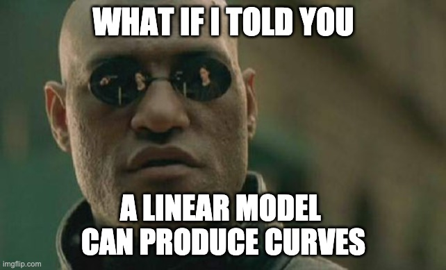

<!-- HTML style -->
<style>
    .main-container {
        /* widen the view */
        max-width: 1400px;
        margin-left: auto;
        margin-right: auto;
    }

    body {
        /* increase the font size */
        font-size: 150%;
    }
</style>

```{r setup, include=FALSE}
knitr::opts_chunk$set(
    echo = TRUE,
    cache= FALSE,
    fig.align="center",
    out.width="75%"
)
```

```{r, echo=F}
# get reproducible random results
set.seed(1)
```

# Outline

In this lecture, we'll look at non-linear regression from several perspectives:

- How to think about non-linear regression
- Parametric non-linear models and generating features
- Non-parametric non-linear models
- Potential pitfalls

# What Is Parametric Non-Linear Regression?

We'll start by talking about parametric regression, which is what we're used to.
Parametric just means "all the parameters are explicitly listed in the model". 

Suppose you have a dependent variable that reacts **non-linearly** to an
independent variable. For example, let's suppose that we want to predict the
grade $G$ you'll get in this class (percentage) as a function of the number of
hours $H$ per week you spend working on the class (on average). There's probably
a positive relationship there.  But once you reach 100%, you can't really go any
higher. And there is probably a diminishing return at some point.

So instead of seeing a relationship like this:

$$ G = 20 \cdot H$$

which suggests that the grade $G$ can go higher than 100% if you work more than
5 hours ($H$) per week, you might expect to see something more like this:

$$ G = 100 \cdot \frac{H}{1 + H} $$

Let's plot both of these:

```{r}
H <- seq(0, 10, by=0.1) # hours put in per week
linear_grade <- 20 * H
nonlinear_grade <- 100 * H / (1 + H)
plot(H, linear_grade, type="l", col="red", xlab="Hours spent per week", ylab="Grade")
lines(H, nonlinear_grade, col="blue")
abline(h=100, col="gray") # the max grade!
legend("topleft", legend=c("Linear: 20 * H", "Nonlinear: 100 * H/(1+H)"),
       col=c("red", "blue"), lty=1)
```

Suppose we have data and we want to fit the data with something like the
non-linear blue curve? How can we do that with a linear model? **Isn't a linear
model necessarily a (straight) line?**

\ 

## "Linear Model" does not mean "Straight Line"

<center>
{ width=50% }
</center>

\ 

Surprise! **We can use linear models to fit non-linear relationships
(formulae).** So, we already have most of the tools we need.

How is it possible to use a linear model to fit a non-linear formula? Doesn't
"linear" imply "straight line"? Well, not exactly, no!  We have to take a deeper
look at what is "linear" about a linear model. The thing we need to understand
is:

> **Linear models are linear with respect to their *coefficients*.**

That is, both of these are linear models:

$$y = a + b \cdot x + c \cdot z \qquad \qquad y = a + b \cdot x + c \cdot x^2$$

because each of the coefficients ($a$, $b$, $c$) are combined by simple addition
and multiplication with the variables ($x$, $z$), with none of the
coefficients being multiplied together. Note that the second one is a linear
model even though it involves $x^2$. Due to that $x^2$, when plotted as a
function of $x$, it has a curve that looks like this (for particular values of
$a$, $b$, and $c$):

```{r}
x <- seq(0, 5, by=0.1)
y <- 1 + 20 * x - 3 * x ^ 2
plot(x, y, type="l", main="y = 1 + 20x - 3x^2", lwd=3)
```

## Example: Fitting Non-Linear Data with a Linear Model

Let's generate some (synthetic) data and then use the `lm()` command to find the
coefficients that fit it.

```{r}
y_noisy <- y + rnorm(y) * 10
plot(x, y_noisy, xlab="x", ylab="y", main="Fitting a curve to noisy data with lm")

# Fit a curve of y ~ x + x^2 -- notice the I(x^2) (instead of just "x^2").
# Inside and outside of a formula, the "^" operator does different things.
# Outside of a formula, "^" means exponentiation. Inside, it means "interaction
# between variables" (which is not the same thing). So we use "I(x^2)" to say
# "we really mean exponentiation here" inside of a formula.
model_x2_x <- lm(y_noisy ~ x + I(x^2))

# leave out the "x" term, for demonstration (does not give a good fit)
model_x2_only <- lm(y_noisy ~ I(x^2))

# Here's another way to do it with the "poly" method (with "raw=T" to use
# "standard" polynomials). Note that it has the same coefficients as what we
# found above for model_x2_x.
model_poly <- lm(y_noisy ~ poly(x, 2, raw=T))

# plot the "true" curve and the curve found by lm
lines(x, y, col="black", lwd=3)
lines(x, predict(model_x2_only), col="red", lwd=3)
lines(x, predict(model_x2_x), col="green", lwd=3) # this curve doesn't show!
lines(x, predict(model_poly), col="blue", lwd=3) # it's covered by this curve.

print(coef(model_x2_x))
print(coef(model_poly))
print(coef(model_x2_only))
```

There are several things to note from this plot:

- The black curve (truth) iis pretty close to the blue curve fitted with
  `poly(...)`.
- The green curve fitted with `y ~ x + I(x^2)` is not visible because it's
  identical to the blue curve with `poly(...)`
- The red curve for `y ~ I(x^2)` is missing the `x` feature, making it less
  able to fit the data.

Also, note that we hand-picked a model (`y ~ x + I(x^2)`) that we *knew* would
fit our data well, because we know how the data were generated. In practice, we
have to pick our model carefully, and we usually don't know in advance what a
reasonable model might be.

\ 

> **But, wait... explain again why the lm looks like a curve and not a line?**

The function `lm()` really is fitting a "line" (actually a plane) in the space
that includes not only $x$, but **also $x^2$** (as a separate "variable").  But
because we are plotting with respect to only $x$, it looks in that space like a
curve.

So, to summarize: a linear model is linear in the *coefficients*, not
necessarily in the *original data space*. That is, the coefficients are never
multiplied with each other (e.g. $a \cdot b$), but the original variables could
be transformed (causing something that looks non-linear in the original
representation).

## Thinking about Non-Linearity

Consider these two plots, which have the same $y$ values but are plotted using
different $x$ values (original $x$, and $x^2$). What appears to be a curve in one
representation can be converted into a straight line when plotting $y$ relative
to $x^2$.

```{r}
par(mfrow=c(1, 2))
x <- seq(0, 5, by=0.5)
y <- x ^ 2
plot(x, y, type="l", lwd=3, ylab="y = x^2", main="original x scale gives a curve")
points(x, y)
plot(x ^ 2, y, col="red", type="l", lwd=3, ylab="y = x^2", main="x^2 scale gives a line")
points(x^2, y, col="red")
```

Thus, if we can fit the formula `y ~ x^2`, we have a chance to fit a straight
line in a different representation of the data, which appears to be a curve when
plotted in the original $x$ space. You may also notice that the points are
spread differently in the $x^2$ space.

\ 

## More Examples of Linear Models that Appear Non-Linear

```{r}
x <- seq(0, 5, by=0.1)
par(mfrow=c(2,2))
y <- x^3 - 8*x^2 + 16*x - 1
plot(x, y, type="l", main="a*x^3 - b*x^2 + c*x + d")
y <- 10 * sqrt(x) - 3*x
plot(x, y, type="l", main="a*x + b*sqrt(x) + c")
y <- 1 + exp(x)
plot(x, y, type="l", main="a*exp(x) + b")
sigmoid <- function(x) { exp(-x) / (1 + exp(-x)) }
y <- sigmoid(10 - 4 * x)
plot(x, y, type="l", main="a*sigmoid(x) + b")
```

Again, all of these are plotted with respect to $x$, which is why they look
non-linear. But if we had data, we could fit all of them with a linear model
using `lm()`. The coefficients that `lm()` would be fitting would be the $a$,
$b$, $c$, and $d$ terms. Note that *those* terms are not multiplied together
(hence, the model *is* linear in those terms, the coefficients).

\ 

## Feature Generation

**We call $x^2$, $\sqrt{x}$, and others like them "generated features" from the
original variable $x$.** Any feature that we generate from the original variable
is called a generated feature. We can generate as many as we like, such as
$x^3$, $x^{10}$, etc. We can even generate features that are **interactions**
between multiple different variables, such as $x_1^2x_3^4x_9$. But we'll see
later reasons to restrain ourselves (see: [Pitfalls](#pitfalls)).

\ 

## Limitations of Linear Models

The `lm()` solver **cannot** fit a model where the coefficients are *inside* a
(non-linear) function, e.g.

$$y = \exp(a + b \cdot x)$$

```{r}
x <- seq(0, 5, by=0.1)
# make an empty plot (type="n") to reserve space for the lines below
plot(x, x, type="n", ylab="y", main="y = exp(a + b * x) for various a, b")
b_vals <- c(1, 2)
colors <- c("red", "blue")
for (b in b_vals) {
    for (a in c(-3, -4, -5)) {
        lines(x, exp(a + b * x), col=colors[b])
    }
}
legend("topleft", legend=paste("b = ", b_vals), col=colors, lty=1)
```

Here, both $a$ and $b$ are coefficients that control the shape and location the
curve ($a$ controls the location along $x$, $b$ controls the steepness). But $y$
is *not* a linear function of those two coefficients. So while we could still
fit this function to data, we could not do so directly with `lm()`. When faced
with a problem like this, we either have to:

- **Change the representation** using a transformation of the model (and the
  dataset). For example, taking the log of both sides gives 
  $\log(y) = a + b \cdot x$. Now this is a linear model (in the coefficients),
  and we can fit it with `lm()`. However, keep in mind now that the predictions
  are for $\log(y)$, not for $y$.
- When we cannot convert the model into something that `lm()` can directly
  solve, **we would need to use a non-linear solver**. That's beyond the scope of
  this lecture, but it's possible (and often more computationally costly).

## Summary of Parametric Non-Linear Curve Fitting

You can use `lm()` to fit a curve to your data. All you need to do is decide on
the features you want to generate:

- Polynomial -- e.g. $x^3$
- Exponential
- Logarithmic -- we've already seen this several times
- Cosine / Sine (good for cyclic data)
- Sigmoid -- good for bounding variables that have a large range

But you have to be careful to choose only features that make sense. Again, see
[Pitfalls](#pitfalls).

----

\ 

# Non-Parametric Methods

Everything we've discussed above uses a type of model (or formula) known as
*parametric* -- which simply means that we are fitting a fixed number of
parameters (aka coefficients). For example, in the formula $y = a\cdot x^2 + b
\cdot x + c$, there are three parameters: $a$, $b$, and $c$.

A different and more flexible type of model is known as *non-parametric* --
there is no explicit single model -- and no fixed set of parameters
(coefficients) we are trying to fit. Instead, the model is predicted from the
data that is "close to" the independent variables.

A simple way to think about a non-parametric model is that it does something
like this: to make a prediction for independent value $x$, it finds the
observations that are most similar to $x$, and computes an average of their
associated dependent values. We get different methods for non-parametric models
depending on:

- how we define "similarity" between observations
- how far we extend our search for similar observations
- how we compute the average of the dependent value
- how we weight the similar observations

Here's a picture of how this works:

```{r}
x <- seq(0, 5, by=0.1)
y <- 3 * (x - 2) ^ 2 + 4 + rnorm(x) * 2

localPredict <- function(xx, width) {
    left <- xx - width / 2
    right <- xx + width / 2
    abline(v=left, col="red")
    abline(v=right, col="red")
    abline(v=xx, col="blue", lwd=2)
    local_points <- which(x >= left & x <= right)
    local_fit <- lm(y[local_points] ~ x[local_points])
    points(x[local_points], y[local_points], col="red", pch=19)
    abline(local_fit, lwd=3)
}

plot(x, y)
localPredict(4, 0.5)
localPredict(1, 1)
```

In this plot, to make a prediction at the vertical blue line, we might take a
"window" of observations that are within a some distance on either side (red
vertical lines). Then fit a straight line to just those observations. That line
is locally-useful, but not globally. So to make a prediction at any $x$, we must
do this procedure again. The plot shows the procedure for two different $x$, and
two different widths.

A full discussion of these issues is beyond the scope of this lecture. But a key
way to think about the difference between parametric and non-parametric models
is this: after you fit a parametric model, you can throw away your data, and
still make predictions. But with a non-parametric model, you must keep your data
in order to make predictions.

## Non-Parametric Fitting in R

There are many non-parametric approaches. Here are three that you can use in R:

- `loess(y ~ x)` -- "Local Polynomial Regression Fitting"
    - Uses formula notation.
    - Returns a model.
    - Get fitted values with `predict(model)`.
    - Suitable for multiple independent variables (multivariate).
- `lowess(x, y)` -- "Locally Weighted Polynomial Regression"
    - Does not use formula notation.
    - Returns pair of lists of fitted points (not a model).
    - Only for one independent variable (univariate).
- `sreg(x, y)` -- "Cubic Smoothing Spline Regression"
    - In the `fields` library.
    - Does not use formula notation.
    - Returns a model.
    - Get fitted values with `predict(model)`.
    - Only for one independent variable (univariate).

## Examples of (Parametric and) Non-Parametric Fitting

```{r}
suppressMessages(library(fields))
data("WorldBankCO2")
x <- log(WorldBankCO2[,"GDP.cap"])
y <- log(WorldBankCO2[,"CO2.cap"])

# function for finding R^2 from two vectors of observations and predictions
rsquared <- function(y, p) {
  # y: observations
  # p: predictions
  ssr <- sum((y - p) ^ 2)
  sst <- sum((y - mean(y)) ^ 2)
  1 - ssr / sst
}

# the x values are not in sorted order
o <- order(x)
plot(x, y, xlab="GDP per capita", ylab="CO2 per capita")
rsquared_vals <- NULL

###########################
# PARAMETRIC MODELS
lin_model <- lm(y ~ x)
rsquared_vals["linear"] <- summary(lin_model)$r.squared
abline(lin_model, col="red", lwd=3)

cubic_model <- lm(y ~ poly(x, 3, raw=T))
rsquared_vals["cubic"] <- summary(cubic_model)$r.squared
lines(x[o], predict(cubic_model)[o], col="purple", lwd=3)

###########################
# NON-PARAMETRIC MODELS

# Use the lowess smoother -- which produces a sequence of predictions, one for
# each observation
lowess_fitted <- lowess(x, y)
rsquared_vals["lowess"] <- rsquared(y[o], lowess_fitted$y)
lines(lowess_fitted, col="blue", lwd=3)

# use the loess smoother -- which produces a model which we can use to make
# predictions
loess_model <- loess(y ~ x)
p <- predict(loess_model)
rsquared_vals["loess"] <- rsquared(y, p)
lines(x[o], p[o], col="green", lwd=3)

# use the sreg smoother (from the fields package Doug wrote)
sreg_model <- sreg(x, y)
p <- predict(sreg_model)
rsquared_vals["sreg"] <- rsquared(y, p)
lines(x[o], p[o], col="black", lwd=3)

legend("topleft", 
       legend=c("Linear", "Cubic", "Lowess", "Loess", "Sreg"),
       col=c("red", "purple", "blue", "green", "black"),
       lty=1, lwd=3)

rsquared_vals
```

These curves all appear "reasonable", though they certainly differ. The
differences in the non-parametric models come from how each of them
answers the questions mentioned above: what observations are considered "near"
an observation that we're trying to make a prediction for; how the local fitting
and weighting is done, etc.

----

\

# Pitfalls

When using non-linear methods, as with any flexible model, the danger is always
**overfitting**. Overfitting is when we fit the data more than is warranted. You
can think of it as "memorizing" the data used to fit the model, without the
ability to generalize.

This is easy to see in both parametric and non-parametric methods. In parametric
methods, we might overfit by generating too many polynomial features. In
non-parametric methods, we might use too small of a neighborhood for finding
"similar" observations. Either way, we get a model which can fit many/most of
the observations exactly -- leading to an $R^2$ near 1. That sounds great...
until we look at the fit!

```{r}
plot(x, y, xlab="GDP per capita", ylab="CO2 per capita")
rsquared_vals <- NULL

# this is a degree-50 polynomial, which is vastly, vastly more complicated than
# this data warrant (or probably most any dataset you'll ever encounter)
overfit_poly <- lm(y ~ poly(x, 50, raw=T))
rsquared_vals["overfit poly"] <- summary(overfit_poly)$r.squared
lines(x[o], predict(overfit_poly)[o], col="purple", lwd=3)

# the "span=0.1" makes this overfit -- each prediction only looks at a small
# nearby neighborhood
overfit_loess <- loess(y ~ x, span=0.1)
p <- predict(overfit_loess)
rsquared_vals["overfit loess"] <- rsquared(y, p)
lines(x[o], p[o], col="green", lwd=3)

rsquared_vals
```

The $R^2$ values are higher than what we saw before. But that
is *not* an indication that these are better models! Look at them!


## Overcoming Overfitting

We could combine techniques from our previous lecture on variable selection to
choose a model that is simple enough but still predictive. Here's one way we
could do that with parametric models (similar ideas also apply to non-parametric
models):

- Generate a lot of features, including non-linear features.
- Fit a penalized regression model using LASSO, which should remove all but the
  most relevant features.

```{r}
suppressMessages(library(glmnet))

# Construct a matrix with columns for a polynomial up to order 10.  We're not
# using "raw=T" this time; instead, we are using "orthogonal" polynomials which
# tend to perform better.
X <- poly(x, 10)

lasso_fit <- cv.glmnet(X, y)
full_fit <- lm(y ~ X)
coef(lasso_fit)
coef(full_fit)

# plot the results
lasso_p <- predict(lasso_fit, X)
full_p <- predict(full_fit)
plot(x, y, xlab="GDP per capita", ylab="CO2 per capita")
lines(x[o], lasso_p[o], col="red", lwd=3)
lines(x[o], full_p[o], col="blue", lwd=3)

rsquared_vals <- c("lasso" = rsquared(y, lasso_p),
                   "full" = rsquared(y, full_p))
rsquared_vals
```

LASSO removed many of the non-linear components, leaving us with a simpler
model.  The $R^2$ for the more complicated model is better than for the LASSO
model, but the LASSO model is much simpler. And the more complicated model
appears to be too complex. 

```{r}
# look at how the coefficients change with the value of (log) lambda
plot(lasso_fit$glmnet.fit, xvar="lambda", label=TRUE)
```
