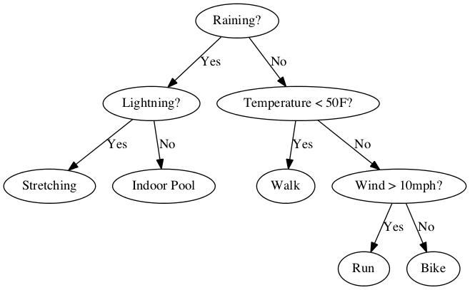

<!-- HTML style -->
<style>
    .main-container {
        /* widen the view */
        max-width: 1400px;
        margin-left: auto;
        margin-right: auto;
    }

    body {
        /* increase the font size */
        font-size: 150%;
    }
</style>

```{r setup, include=FALSE}
knitr::opts_chunk$set(
    echo = TRUE,
    cache= FALSE,
    fig.align="center",
    out.width="95%"
)
```

```{r, echo=F}
# get reproducible random results
set.seed(1)
```


# Outline

In this lecture, we'll look at *classification methods*.

- What is Classification?
    - Binary, Multiclass, Ordinal, etc.
- Nearest Neighbor Methods
- Decision Tree Methods
- Other Methods

# What is Classification?

During these modeling lectures, we've talked about:

- **Regression**: predicting a numeric (continuous) dependent variable $y$.
    - Example: predicting ammonia level in a wastewater treatment.
- **Clustering**: grouping data by its independent variables (only; there is no
  dependent variable). 
    - Example: grouping together similar images in a collection.

**Classification** is a third kind of modeling problem, where the dependent
variable $y$ is a *class*, or *category*. A class is usually not numeric -- it's something like
positive/negative, or a color, or even a word. Classes can be nominal
(unordered), such as "red", "green", "blue", or ordinal (i.e.  ordered), such as
"low", "medium", "high".

Sometimes to make the math work, we *represent* the class with a numeric value
(e.g. green = 1, red = 2), but just like "red - green" doesn't make mathematical
sense, we wouldn't expect meaning from "2 - 1" if those values represented classes.
This is true even for ordinal values (e.g. "high" - "medium" is not a numeric
value).

There are two types of classification problems: **binary** and **multiclass**.

## Binary: two classes

The classes are often called "negative" and "positive". We might *represent*
those classes with a dependent variable $y$ which can take values $-1$ and $1$
(or $0$ or $1$).  Some examples of binary classification are:

- Given the results of a blood test, does a person have a certain medical
  condition? (The classes are positive and negative.)
- Given an email, is it spam or not? (The classes are spam and not spam.)

Some classification models only work for binary classification, such as
*logistic regression* and *support vector machines*.

## Multiclass: more than two classes

For example:

- Given a student's performance thus far, what will be their letter grade?
  (The classes are "A", "B", "C", "D", or "F" -- which are ordinal.)
- Given the last few words a person said, what will be their next word? (The
  classes are all the words in the language in which they are speaking --
  which is not ordinal.)

There are many classification models that work for multiclass classification,
such as *nearest neighbor* and *decision trees*. Of course, any multiclass
model can do binary classification without modification.

## Classification in R: Using Factors

In R, when the dependent variable is a class, we use a **`factor`** type. That
just tells R that "this is a factor" (i.e. class). Examples:

```{r}
(colors <- factor(c("red", "green", "blue")))
colors[1]
```

Note that factors can be ordered (e.g. low, medium, high), and can even use
numeric values, but they **cannot** be treated as numbers in R:

```{r}
(classes <- factor(c(10, 20, 30), ordered=T))
classes[1] - classes[2]
```


## Training versus Test Data

In what follows, we're going to use "training" data and "test" data. (Test data
is sometimes referred to as validation data, though the terms mean slightly
different things.)

The point of splitting data into training and test is to get an unbiased view of
the performance of our model. It helps us avoid overfitting. We don't want to
just be able to make predictions on observations used to build the model (the
training set) -- that's just memorization. We want to measure prediction
performance on observations that were not used for building the model -- and
that is the role of the test set.

We've talked a bit about overfitting in the past few lectures. Here's the most
direct way to detect overfitting: the performance on the training data is much
better than the performance on the test data.

Let's do an experiment. I am going to give you 3 numbers and associated colors.

- 10, blue
- 20, green
- 30, blue

What if I quiz you on the colors associated with these numbers? If I said "20",
you'd say "green". You can memorize three observations, and you can ace my quiz
if I say 10, 20, or 30. But what if I gave you the number 25? Ah, that you
haven't seen before, and knowing how to answer that requires you to generalize
(with a model).


----

\ 

# Nearest Neighbor Methods

The **Nearest Neighbor** classifier is conceptually very simple. Here's how it
works:

- The inputs are:
    - A "training set" of observations $x_1$ through $x_n$, and associated
      labels $y_1$ through $y_n$.
    - A query observation $x_q$ (or multiple queries).
- The process is: For query $x_q$, find observation $x^*$ (from training
  observations $x_1, \ldots, x_n$) that is closest (in distance) to $x_q$.
- Output: $y^*$ (the label for $x^*$) as the predicted label for $x_q$.

## Example of Nearest-Neighbor in R

We'll use the famous `iris`
dataset^[https://en.wikipedia.org/wiki/Iris_flower_data_set].  The observations
are of iris flowers of different species, and each observation contains four
independent variables which are measurements of individual flower petals, and a
class label which is the particular species of the flower. Our goal is to
predict the species from the measurements.  Conveniently, the `iris` dataset is
built-in to R.

```{r}
data(iris)
head(iris)
levels(iris$Species)
```

Note that the `Species` variable is a *factor*, and it is the variable we are trying
to predict. The class for an observation is one of the levels we see above.
Next, we're going to do some data wrangling to split the data into training and
test sets, and rescale the range of the variables (note carefully how we do
this).

```{r}
independent_vars <- c("Sepal.Length", "Sepal.Width", "Petal.Length", "Petal.Width")
dependent_var <- "Species"

n <- nrow(iris)

# create a shuffling of the observations, so that we can take a sample across
# the entire dataset
set.seed(1)
permutation <- order(runif(n))
n_train <- 50
n_test <- 100

# Select a subset for train, and subset for testing.
train_indexes <- permutation[1:n_train]
test_indexes <- permutation[(n_train+1):(n_train+n_test)]
train <- iris[train_indexes,]
test <- iris[test_indexes,]

# Rescale the independent variables, so each has equal influence on the
# distances. Note that we use the standard deviation of *only* the train data
# for the scaling.
for (v in independent_vars) {
    # Rescale train and test -- based *only* on the standard deviation of train
    s <- sd(train[,v])
    train[,v] <- train[,v] / s
    test[,v] <- test[,v] / s
}

# Look at the train data
pairs(train[,independent_vars], pch=19, col=as.numeric(factor(train[,dependent_var])), main="Training data")
```

Next, we actually make predictions for `test` based on `train`

```{r}
suppressMessages(library(class)) # for the knn() function

# Run the nearest neighbor algorithm to make predictions on test.
predictions <- knn(train[,independent_vars], test[,independent_vars], train[,dependent_var])

colors <- sort(as.numeric(unique(train[,dependent_var])))
par(mfrow=c(1,3))
plot(test[,1:2], pch=19,          col=test[,dependent_var], main="Test labels")
legend('topleft', legend=levels(train[,dependent_var]), col=colors, pch=19)
plot(test[,1:2], pch=19, ylab="", col=predictions, main="Test predictions")
plot(test[,1:2], pch=19, ylab="", col=(1 + (predictions != test[,dependent_var])),
     main="Prediction errors")
legend('topleft', legend=c("Correct", "Error"), col=1:2, pch=19)
```

## Measuring Performance

Now, let's calculate the accuracy, error rate, and confusion matrix -- on the
*test data* for our predictions.


```{r}
(accuracy <- mean(predictions == test[,dependent_var]))
(error_rate <- 1 - accuracy)

# Define a function for constructing a confusion matrix from two vectors:
#   labels: a factor vector of the true labels
#   predictions: a factor vector of the predicted labels
# The resulting matrix has the true labels as rows, predicted labels as columns.
confusionMatrix <- function(labels, predictions) {
    num_classes <- length(levels(labels))
    confusion_matrix <- matrix(0, num_classes, num_classes) 
    colnames(confusion_matrix) <- rownames(confusion_matrix) <- levels(labels)
    stopifnot(length(labels) == length(predictions))
    for (c1 in levels(labels)) {
        for (c2 in levels(labels)) {
            confusion_matrix[c1,c2] <- sum(labels == c1 & predictions == c2)
        }
    }
    confusion_matrix
}

# call the function we defined above to get a confusion matrix
confusionMatrix(test[,dependent_var], predictions)
```

The "confusion matrix" shows for each true class (row) how many
times each class was predicted (column), and it is very useful for communicating
more detail than just accuracy or error rate. From a confusion matrix, we can
calculate many quantities of interest, like accuracy, error rate, per-class
error rates, recall, precision, F-measures, etc.


## Comments on Nearest-Neighbor Classifier

- **Simplicity and optimality**: The nearest-neighbor classifier is simple, but
  when handled well (proper data scaling, etc.) it can perform remarkably well
  with respect to prediction accuracy (something we can even mathematically
  prove).
- **Handling multiclass**: nearest-neighbor can handle multiclass easily, as we
  saw.
- **Non-parametric**: this is a non-parametric method. There is no real
  phase where we fit coefficients; we just search the train observations for the
  closest match. That's why we have to provide the training data.
- **Speed**: nearest-neighbor can be slow for making predictions (why?). There
  are many methods to speed it up. One of the simplest is taking a sub-sample of
  your train data.  There are lots of interesting geometric tricks too.
- **Robustness**: we can generalize the nearest-neighbor classifier to the
  **$K$-nearest-neighbor** (or KNN) classifier (which is why the R method is
  called `knn`).  The KNN classifier finds the **$k$** closest neighbors for a
  query, and then takes a vote to predict the label. Typically we use an odd
  value for $k$, such as 3 or 5.
- **Distance metric considerations**: just as in clustering, and all
  distance-based methods, we have to be careful to include/not include the
  independent variables that are relevant, and scale them appropriately.
  Otherwise, the independent variable(s) with the largest scale(s) will dominate
  distance calculations.
- **Other tasks**: nearest-neighbor methods can also be used for regression and
  density estimation / clustering tasks.
- **Perfect Training Set Performance**: the 1-nearest neighbor classifier will
  get *perfect* accuracy on its own training set, since each observation is its
  own nearest neighbor. This emphasizes the fact that we need to use separate
  testing data to evaluate the model's performance.

---

\ 

# Decision Tree Methods

A *decision tree* is a method of organizing decisions, hierarchically. For
example, imagine trying to decide on an exercise for the day:



In a tree like this, each node (ellipse) is either for making a decision, or a
classification. The decision nodes have question marks (in this example), but
more importantly, they have children nodes. The leaves (nodes which have no
children) give the predicted classifications.

To classify an observation, start at the top and work downward. At each decision
node, answer the question and follow the edge to the appropriate child node.
Keep going until you reach a leaf node. That leaf node contains the predicted
class.

Decision trees are popular for classificaiton because:

- They are easily **interpretable** by humans.
- They can **run quickly** (each decision node requires testing only one variable).
- They can have **high accuracy** on many problems.

## Decision Tree Construction

If we have some observations (with labels), how do we build a decision tree that
fits those observations and labels well? We do it *recursively*:

1. If all (or most) of the labels are the same, then stop.
1. Find the single decision that best classifies the observations.
1. Partition the observations according to that decision.
1. For each partition of the data, build a child node with that data (by going
   back to #1).

There's a lot of details we have skipped, and we don't have time in this lecture
to dive into them. But I'll mention what I consider the most important:

- At what point are "most" of the labels the same?
- How do we define the **best** decision (among many options)?
    - Answer: "information gain", which is based on *label entropy reduction*.
- How do we construct a decision when an attribute is *numeric*?
    - I.e. should the decision be "temperature < 50", or "temperature > 80", or
      something else?
- How do we deal with *overfitting*? 
    - I.e. when a tree fits the training data too closely.


## An example in R using `rpart`

```{r}
suppressMessages(library(rpart))

iris_rpart <- rpart(Species ~ ., data=train)
print(iris_rpart) # textual representation
par(mfrow=c(1, 2))
plot(iris_rpart, margin=0.2)
text(iris_rpart, use.n=T)

plot(train[,c("Petal.Length", "Petal.Width")], pch=19, col=as.numeric(factor(train[,dependent_var])), main="Training data")
abline(v=1.738, col="red")
abline(h=2.168, col="red")
```

This model is quite simple -- with only two queries, we can make fairly
accurate predictions on the training data. But we care more about the testing
data. Let's look at the generalization performance.

```{r}
predictions <- predict(iris_rpart, test, type="class")
print(sum(predictions != test$Species))
confusionMatrix(test$Species, predictions)
```

This model performs slightly less well than the nearest neighbor classifier, but
the differences are small. And it's a very simple model, which is very good from
the viewpoint of Occam's razor.


## Comments on Decision Trees

- **Non-parametric** model in the sense that the number of parameters is not
  fixed. However, once the tree is built, we can "throw away" the training data.
- **Speed**: once the tree is built, prediction time is as long as the number of
  decisions in the tree.
- **Overfitting** a common problem with trees, as with many models (especially
  non-parametric), is overfitting -- fitting the training data more than is
  warranted. Evidence of overfitting: poor generalization; complicated trees.
  Fixes for overfitting include cross-validation and pruning.
- **Random forests** are an extension of decision trees which uses a combination
  of many trees to make predictions. They are much more complicated and harder
  to interpret, but they can achieve high accuracy and good generalization.
- **Interacting variables**: More advanced trees may construct decision nodes
  that test interactions between random variables, such as "Temperature *
  WindSpeed > 300".
- **Other tasks**: Tree-based models can perform other tasks such as regression.

---

\ 


# Other Methods

There are many classification methods; here are a few others to be aware of and
what they are good for. All of the following are **parametric** models:

- Support Vector Machines (SVMs):
    - Binary classification
    - Find a "wide margin" plane that separates two classes
    - Can be generalized to nonlinear with "kernel methods"
    - Strong mathematical foundation
    - Has good generalization performance; tends not to overfit; good for data
      with many variables ("high dimension")
- Logistic Regression:
    - Binary classification (despite the name)
    - Classical technique
    - Also fits a plane that separates two classes
    - Can easily fit and output probabilities (rather than just classes)
    - Multinomial Logistic Regression can do multiclass
- Linear and Quadratic Discriminant Analysis (LDA and QDA)
    - Multiclass
    - Fit a Gaussian distribution to each class
    - Classify by assigning the class whose Gaussian mean is nearest (with the
      distance reweighted via the covariance matrix)
    - Decision surfaces are linear or quadratic between each pair of classes,
      depending on whether the Gaussian covariances are assumed to be equal or
      allowed to differ across classes.
- Naive Bayes
    - Multiclass
    - Used often in textual and other high-dimensional data
    - "Naive": assumes statistical independence among independent variables,
      conditioned on the dependent variable.
- Neural Networks
    - Multiclass
    - Extremely wide variety of architectures and techniques
    - Currently the most popular technique for many modeling problems
    - Can be hard to interpret

<!--
---

```

train <- train[train$Species != 'virginica',]
test <- test[test$Species != 'virginica',]

logistic_fit <- glm(Species ~ ., data=train, family="binomial")
print(logistic_fit)
predictions <- predict(logistic_fit, test) >= 0
c(
print(predictions)
confusionMatrix(test$Species, predictions)

```
-->
