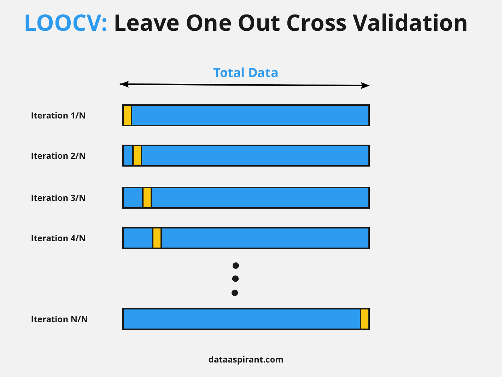
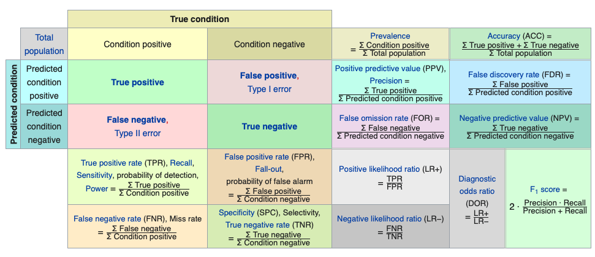

```{r setup, include=FALSE}
knitr::opts_chunk$set(
  comment = "#", 
  fig.height = 4, 
  cache = FALSE,  
  collapse = TRUE,
  error = TRUE,
 warning = FALSE, 
 message = FALSE,
  tidy.opts=list(width.cutoff=65)
)
```

CSI 2300: Introduction to Data Science

Lecture 25:  Model Validation


<!-- \begin{center} -->
<!-- Lecture -->
<!-- \end{center} -->


# Today's Topics 

## Metrics of Success
* continuous
* categorical

## Validation Approaches
* Testing/Training
    - Independent observations
    - Dependent observations
* Leave X-out Cross-Validation


# Metrics of Success

We've already covered measures of model fit, and we've seen in previous lectures how they can be misleading and lead to overfitting.  For example, including additional predictor variables in a linear model always leads to an increased $R^2$, even if those predictors are uncorrelated with the response.  The goal is to capture the overall pattern in the data and not to simply memorize the observations. To review, here are some of the measures of model fit that we have used along with a new one.  Let $y_i$ be the response of interest, and let $\hat y_i$ be the predicted value based on some model for observations $i = 1, \ldots, n$.  

##Continuous Response

1.  **R$^2$**:  The $R^2$ represents the proportion of the variability in the response that can be explained by the predictors.  It varies between 0 and 1, with values closer to 1 considered better.  It is often expressed as a percentage.  This was defined in Lecture 19, but to review,
 $$R^2 = 1 - \frac{SSE}{SST},$$
where
$$SSE = \sum_{i=1}^n (y_i - \hat{y}_i)^2 $$
and
$$SST = \sum_{i=1}^n (y_i - \overline{y})^2$$
with $\bar y$ the overall mean of the responses.  The $R^2$ can be interpreted as the proportional improvement in prediction using the model versus simply using the overall mean.  As long as you aren't doing constrained or penalized optimization (such as LASSO), you can also obtain the $R^2$ by computing the correlation between the response and the predicted values.

2.  **Root mean square error (RMSE)**:  The root mean square error puts the average of the squared errors back in the same units as the response by taking the square root.  Lower values are better.  It is defined as:

$$RMSE = \sqrt{\frac{1}{n}\sum_{i=1}^n (y_i - \hat y_i)^2} = \sqrt{\frac{SSE}{n}}$$

3.  **Mean absolute error (MAE)**:  Compared to RMSE, the MAE gives less weight to observations with very large errors by averaging the absolute value of the errors instead of squaring them. Lower values are better.  It is defined as:
$$MAE = \frac{1}{n}\sum_{i=1}^n |y_i - \hat y_i|$$

You have also seen AIC and BIC used as model selection criteria.  These metrics balance a good model fit (i.e., low SSE) with a penalty for the number of parameters in the model, so the more complex the model, the bigger the penalty.  

***
**Example, Wind Power:** The amount of wind power that can be generated by a wind turbine depends primarily on the wind speed and the length of the turbine blades. 

$$P = 0.5 r A v^3$$
with 

* $P$, power
* $r$, density of air
* $A$, area swept by blades
* $v$, wind speed

It is a little bit more complicated in practice as power is not generated below a certain speed, power generation is maximized for a range of speeds, and then the power cuts out at high wind speeds.

```{r echo=FALSE}
suppressMessages(library(viridis))
load("kenn_dec2013.Rda")

wind_power <- kenn_dec2013$Wind.Speed.MPH

less_than <- which(kenn_dec2013$Wind.Speed.MPH <= 9)
greater_than <- which(kenn_dec2013$Wind.Speed.MPH >= 56)
flat_part <- which(kenn_dec2013$Wind.Speed.MPH > 22 & kenn_dec2013$Wind.Speed.MPH < 56)
cubic_part <- which(kenn_dec2013$Wind.Speed.MPH > 9 & kenn_dec2013$Wind.Speed.MPH <= 22)

set.seed(77)
wind_power[less_than] <- rep(0, length(less_than)) + rnorm(length(less_than), 0, 1)
wind_power[greater_than] <- rep(0, length(greater_than)) + rnorm(length(greater_than), 0, 5)
wind_power[flat_part] <- rep(1500, length(flat_part)) - abs(rnorm(length(flat_part), 0, 20))
wind_power[cubic_part] <- 0.000133*(0.30)* ((kenn_dec2013$Wind.Speed.MPH[cubic_part])^3)*(232^2*pi/2)/23.95 - abs(rnorm(length(cubic_part), 0, 150))
 
sub <- sample(1:nrow(kenn_dec2013), 200) 
power_sub1 <- wind_power[sub]
wind_speed_sub1 <- kenn_dec2013$Wind.Speed.MPH[sub]

plot(wind_speed_sub1, power_sub1, pch = 3, ylab = "Wind Power (kW)", xlab = "Wind Speed (mph)", ylim = c(-10,1550))

```

Here, we will only focus on the range of wind speeds where power is a function of the cube of wind speed, and we will illustrate what happens  when a model is overfit.  Here are the first few degrees fit --- linear, quadratic, and cubic.  The quadratic and cubic are very similar.


```{r echo=FALSE}
remove <- which(power_sub1<0 | wind_speed_sub1>22 | wind_speed_sub1 < 9)
power_sub <- power_sub1[-remove]
wind_speed_sub <- wind_speed_sub1[-remove]
plot(wind_speed_sub, power_sub, pch = 3, ylab = "Wind Power (kW)", xlab = "Wind Speed (mph)", xlim = c(8,23), ylim = c(-75,1600))


colors <- viridis(4)
new_frame <- data.frame("power" = power_sub, "speed" = wind_speed_sub)
new_x <- data.frame("speed" = seq(0, 40, len = 1000))

poly_mod <- lm(power ~ poly(speed, degree = 1, raw = F), data = new_frame)
lines(new_x$speed, predict(poly_mod, new_x), col=colors[2], lwd=3)
rsquare <- cor(predict(poly_mod, new_frame), new_frame$power)^2


poly_mod <- lm(power ~ poly(speed, degree = 2, raw = F), data = new_frame)
lines(new_x$speed, predict(poly_mod, new_x), col=colors[3], lwd=3)
rsquare[2] <- cor(predict(poly_mod, new_frame), new_frame$power)^2


poly_mod <- lm(power ~ poly(speed, degree = 3, raw = F), data = new_frame)
lines(new_x$speed, predict(poly_mod, new_x), col=colors[4], lwd=3)
rsquare[3] <- cor(predict(poly_mod, new_frame), new_frame$power)^2

legend("topleft", c("Linear", "Quadratic", "Cubic"), col=colors[2:4], lty=c(1,1,1), lwd=c(2,2,2), bty="n", cex=1.25)
```

But what happens when the degree of the polynomial is allowed to become much larger?

```{r}
plot(wind_speed_sub, power_sub, pch = 3, ylab = "Wind Power (kW)", 
     xlab = "Wind Speed (mph)", xlim = c(8,23), ylim = c(-200,2000))

colors <- viridis(20)
for(i in 4:23){
  poly_mod <- lm(power ~ poly(speed, degree = i, raw = F), data = new_frame)
  new_x <- data.frame("speed" = seq(0, 40, len = 1000))
  lines(new_x$speed, predict(poly_mod, new_x), col = colors[i], lwd=3)
  rsquare[i] <- cor(predict(poly_mod, new_frame), new_frame$power)^2
}
points(wind_speed_sub, power_sub, pch = 3, col=1)
```

We see that the polynomial becomes more wiggly as the degree increases, and the fits at the edges display increasingly erratic behavior as the polynomial seeks to pass through every observation.

```{r}
plot(2:23, rsquare[-1], pch=17, xlab = "Polynomial Degree", 
     ylab = "R-squared", main = "Fitting on Full Dataset")
```

As expected,  the $R^2$ increases as the polynomial degree increases, but clearly, the fits are getting worse, not better.

***


# Validation Approaches

There are a few approaches to solving the overfitting problem, and the one that you choose depends on the size of the dataset that you have and whether the observations are assumed to be independent or dependent.  We've talked about independent and dependent *variables*, but with respect to the *observations*, "independent" refers to whether there is predictive information based on the ordering of the observations.  This depends conceptually on the design of the data collection.  Observations taken over time are more likely to be dependent.  For example, knowing the outdoor temperature right now tells you something about the outdoor temperature ten minutes from now.  If it is 90$^\circ$F  at 1:00 pm, then it is unlikely that we would observe the temperature to be 20$^\circ$F at 1:10 pm. While we do deal with many datasets whose observations are collected over time, for now, we will focus primarily on observations that are independent.

## Testing/Training
    - Independent observations

  With many observations,  
  
  1. The data can be randomly split into two groups.
  2. Assign one group to be the training data and the other to be the testing data.  The proportion of observations assigned to the training data is usually larger than the proportion assigned to the testing data.
  3. Fit the model to the training data.
  4. Use the fitted model to predict the values in the testing data.
  5. Repeat steps 3-4 as needed for different tuning parameters in the model or different types of models.
  
Then, the performance of the various models on the test set (measured in step 4)  is used to judge which model is best. This is a logically sound approach to model selection because by assessing the trained model's fit on the testing data, we have an objective, external, and unbiased assessment of the performance of the model.

***
**Example, Wind Power:**  Split the data into 68\% for training (40 observations) and 32\% for testing (19 observations).  For different degrees of polynomial fit to the training data, compute the $R^2$ for the predictions of the test data.
```{r, error=FALSE}

set.seed(99)
nn <- nrow(new_frame)
rearrange <- sample(1:nn)
train_index <- rearrange[1:40]  #About 68% of the data
test_index  <- rearrange[41:59] #About 32% of the data
  
train <- new_frame[train_index, ]
test  <- new_frame[test_index, ]

rsquare_split <- NULL

for(i in 1:23){
  poly_mod <- lm(power ~ poly(speed, degree = i, raw = F), data = train)
  rsquare_split[i] <- cor(predict(poly_mod,test), test$power)^2
}

plot(1:23, rsquare_split, pch=17, xlab = "Polynomial Degree", 
     ylab = "Test R-squared", main = "R^2 for Test/Train Split")
which.max(rsquare_split)

par(mfrow=c(1,2))
plot(train$speed, train$power, pch = 3, ylab = "Wind Power (kW)", 
     xlab = "Wind Speed (mph)", xlim = c(8,23), ylim = c(-200,2000), 
     main="Training Data: Degree = 2")
poly_mod <- lm(power ~ poly(speed, degree = 2, raw = F), data = train)
lines(new_x$speed, predict(poly_mod, new_x), col=colors[4], lwd=3)
points(test$speed, test$power, pch = 18, col =2)
legend("topleft", c("Training", "Testing"), bty="n", cex=1.2, pch=c(3,18), col=c(1,2))

plot(train$speed, train$power, pch = 3, ylab = "Wind Power (kW)", 
     xlab = "Wind Speed (mph)", xlim = c(8,23), ylim = c(-200,2000), 
     main="Training Data: Degree = 20")
poly_mod <- lm(power ~ poly(speed, degree = 20, raw = F), data = train)
lines(new_x$speed, predict(poly_mod, new_x), col=colors[4], lwd=3)
points(test$speed, test$power, pch = 18, col =2)
```


***  

The maximum $R^2$ on the test data occurs for a degree of 10, but one could argue that practially there is very little difference between the $R^2$ of a model of order 2 and one of order 10 on the testing set.  Thus, the more parsimonious model would be preferred.
    
## Leave X-out Cross-Validation

If the sample size is on the smaller size, then leave $x$-out cross-validation may be a better choice than the train/test split.  

  1. Split the data into many small subsets, each of size $x$.
  2. Remove $x$ observations from the data.
  3. Train the model on the remaining $n-x$ observations.
  4. Use the fitted model to predict the withheld observations.
  5. Return to step 1, and remove the next subset of $x$ observations from the full dataset.
  6. Repeat steps 1-5 until predictions have been made for every the subset of the data.
  7. Repeat steps 1-6 as needed for different tuning parameters in the model or different types of models.
  
{width=60%}

More graphical illustrations and descriptions of cross-validation can be found here:  https://en.wikipedia.org/wiki/Cross-validation_(statistics)

***
**Example, Wind Power:**  Use leave-one-out cross-validation (LOOCV) to train and test different degrees of polynomial models. Then, compute the $R^2$ for the predictions of the test data.

```{r, error=FALSE}

set.seed(99)
nn <- nrow(new_frame)

rsquare_cv <- NULL

# First loop is for the degree of the polynomial
for(j in 1:23){
  save_preds <- NULL
  
  # Second loop is for removing an observation,
  # fitting remaining obs, and predicting left out observation
  for(i in 1:nn){
    new_frame_minus_i <- new_frame[-i, ]
    poly_mod <- lm(power ~ poly(speed, degree = j, raw = F), data = new_frame_minus_i)
    save_preds[i] <- predict(poly_mod, new_frame[i, ])
  }
   rsquare_cv[j] <- cor(save_preds, new_frame$power)^2
}  

plot(1:23, rsquare_cv, pch=17, xlab = "Polynomial Degree", 
     ylab = "LOOCV R-squared", main = "Cross-Validation")
which.max(rsquare_cv)
```

We see that the maximum $R^2$  occurs for a model of degree 2.

***

##Categorical Response

In the case of a categorical response, such as when applying classification models, the confusion matrix is very helpful for "hard" classifications.  Hard classifications are produced by the $k$-nearest neighbor model with one neighbor, or $k=1$, and each observation is assigned a category to which it is most likely to belong.  
"Soft" classifications are those that are probabilistic.  For example, when classifying a new observation, a model may give it a 60\% chance of belonging to class 1, 30\% chance of belonging to class 2, and 10\% chance of belonging to class 3.  A hard classification can be constructed assigning the observation to the class that it has the highest probability of belonging. 

1.  **Confusion matrix:**  For hard classifications, the confusion matrix can be constructed.  It was introduced in Lecture 24, and from it, almost all of the metrics of interest can be derived, of which there are many.  The image below  from https://en.wikipedia.org/wiki/Confusion_matrix illustrates some of these metrics for a binary classifier.




2.  **Accuracy:** This is the sum of the correctly classified observations divided by the total number of observations that are classified.  Accuracy varies between 0 and 1, and values closer to 1 are desired.

3.  **Error:**  This is one minus the accuracy, or the sum of the incorrectly classified observations divided by the total number of observations that are classified. Error varies between 0 and 1, and values closer to 0 are desired.

4.  **Brier score:**  For assessing a probabilistic or soft classifier, the BS uses the predicted probabilities of each class, denoted $p_{i,k}$, $i=1,\ldots,n$ (for $n$ equal to the total number of observations in the testing set) and $K$ the number of classes.  Denote the true class as  $o_{i,k}$. Then,  $o_{i,k}$ is  equal to 1 if observation $i$ is in category $k$ and is 0 otherwise.

$$BS=\sum_{i=1}^n\sum_{k=1}^K(p_{i,k}-o_{i,k})^2$$
If the classifications, $p_{i,k}$, are close to 1 when $o_{i,k}$ is 1, then the $BS$ will be small.  In fact, $BS$ varies between 0 and 1, and  values closer to 0 are better.  It can also be used for hard classifications, but its strength is in its ability to handle soft classifiers.


##Recap

* Identify the type of response that you have --- categorical or quantitative.

* Identify the metric(s) that will be used to measure model quality.

* Identify the models that you plan to investigate.

* Choose either test/train for large a dataset or CV for a small dataset.

* Fit the models, and compare metrics across models and/or model tuning parameters to choose the best model and/or tuning parameters.

This process ensures an unbiased model selection process and reduces the chances of overfitting a model.


